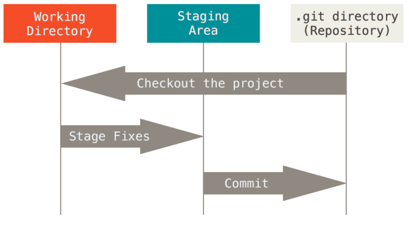
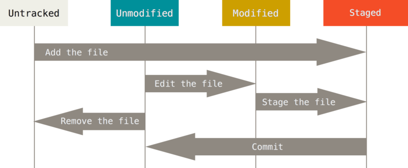

# git 특강 1일차

## git 이란: 분산 버전 관리 프로그램

버전 : 컴퓨터 소프트웨어의 특정 상태
git은 *Working ditrctory - Staging Area - Commits 의 세 공간으로 이루어져 있다.*

Interface란, 서로 다른 객체 A, B가 만나는 지점으로 '사용자와 컴퓨터가 서로 소통하는 접점'을 의미한다.

git init의 의미 : 이제부터 이 폴더를 git을 통해 관리해주겠다! 선언하는 것 

### GUI vs CUI

1. **GUI (Graphic User Interface)**: 그래픽을 통해 사용자와 컴퓨터가 상호작용하는 방식 "그래픽으로 커뮤니케이션을 한다"

2. **CLI(Command Lind Interface)**: 터미널을 통해 사용자와 컴퓨터가 상호작용하는 방식 "라인으으로 커뮤니케이션을 한다"

- **Mac에서 이용하는 기본 터미널 명령어**
  - *home 폴더 가기* :  terminal에서 *open .*입력
  - 폴더 만들기 : *mkdir [폴더명]* 띄어쓰기를 이용해 여러 폴더를 한번에 여러 개 만들 수 있다.
  - 파일 만들기 : *touch [파일명.확장자]*
  - 디렉토리 이동 : *cd [이동할 디렉토리]*
  - 폴더에 들어갈 때는 *.* 상위폴더로 나올 땐 *..* 을 입력한다.
  - 터미널 깨끗하게 청소 : *control + l*

* *ls*

  *ls* 를 입력하면 현재 내가 위치한 곳에 있는 폴더들을 나타내어준다.

  - ls -a : all 옵션. 숨긴파일까지 모두 보여준다.
  - ls -l : long 옵션. 파일 정보를 자세히 보여준다.
  - ls -a -l : all&long옵션. all, long 모두 
  - ls -al : all&long옵션. all, long 모두

* *mv*

  move. 폴더 or 파일을 다른 폴더 내로 이동하거나 이름을 변경하는 명령어

  단, 다른 폴더로 이동할 때에는 작성한 폴더가 반드시 있어야 한다.

  예) a.txt를 folder 폴더에 넣기: *mv a.txt folder*

  예) a. txt를 b.txt 로 이름 바꾸기: *mv a.txt b.txt*

* *cd*

  change directory. 현재 작업중인 디렉토리를 변경

  cd ~ : home화면으로 이동(그냥 cd만 입력해도 home으로 이동한다.)

  cd .. : 부모 디렉토리로 이동

  cd - : 뒤로가기. 바로 전 디렉토리로 이동

* *rm*

  폴더 or 파일을 지우는 명령어. 휴지통으로 이동하는 게 아닌, 완전 삭제 개념

  * *rm a.txt : 파일 삭제*

  * *rm -r folder : 폴더 삭제*

 vscode에서 터미널을 여는 방법: control + `

git remote add origin [URL]
git push -u origin master : -u를 쓰면 이후에 같은 폴더 push 할 때 git push 만 입력하면 된다.(처음에 -u 했다면 git pull을 할 때도 뒤에 'origin master' 안 붙여도 된다.) 

## git 기초
### git 초기 설정
누가 커밋 기록을 남겼는지 알 수 있도록 이름과 메일 주소를 남기는 작업으로, 최초 한 번만 설정한다. 작성자를 변경하고자 할 때에는 동일한 방법으로 이름, 메일주소를 바꾸면 된다.
*git config --global user.name [이름]
git config --global user.email [메일주소]*

작성자가 잘 설정되었는지 확인 : *git config --global -l*

### git 기본 명령어

- Working directory(= Working tree) : 사용자의 일반적인 작업이 일어나는 곳
- Staging area : 커밋을 위한 파일 및 폴더가 추가되는 곳
- Repository : Staging area에 있던 파일 및 폴더의 변경사항을 저장(커밋)하는 곳

#### git init

현재 작업중인 디렉토리를 git으로 관리하겠다고 선언한다. .git 이라는 숨김 폴더를 생성하고, 터미널에는 master가 나타나게 된다.

*주의사항

1. 이미 git 저장소인 폴더 내에 또다른 git 저장소를 만들면 안 된다. (중첩 금지)
2. 절대로 홈 디렉토리에서 git init을 하지 않는다.

#### git status

로컬 저장소의 파일의 현재 상태를 나타내 준다. Untracked, Unmodified, Modified, Staged 4개의 상태가 있다.

#### git add

Working directory에 있는 파일을 Staging area에 올린다. 

*git add .*  사용 시 현재 디렉토리에 속한 파일/폴더를 모두 올려준다.

하나의 파일만 올려줄 경우 *git add a.txt* 와 같이 사용한다.

#### git commit

Staging area에 올라온 파일의 변경사항을 하나의 버전(커밋)으로 저장. 각각의 커밋은 알고리즘에 의해 반환된 고유의 해시 값을 ID로 가진다.

*git commit -m "적고자 하는 메세지"*

#### git log

커밋의 내역을 알 수 있는 명령어.

*git log --oneline*  한 줄로 축약해 보여준다.

*git log --graph* 브랜치와 머지 내역을 간단한 그래프로 보여준다.

*git log --all* 현재 브랜치 포함한 모든 브랜치 내역을 보여준다.

*git log --reverse* 커밋 내역의 순서를 반대로 보여준다.(가장 최신이 맨 아래)

*git log -p* 파일의 변경 내용도 같이 보여준다.
## github
#### github에 연결하기

*git remote add [이름] [주소]*  예) git remote add origin [URL]

*git remote -v* : 원격저장소에 잘 연결되었는지 확인

*git remote rm [이름]* : 로컬과 원격저장소의 연결을 끊는다.

#### github에 올리기

*git push origin master*

*git push -u origin master* 를 사용하면 두 번째 커밋부터 저장소 이름, 브랜치 이름을 적지 않아도 된다. 즉, *git push* 만 써도 된다.