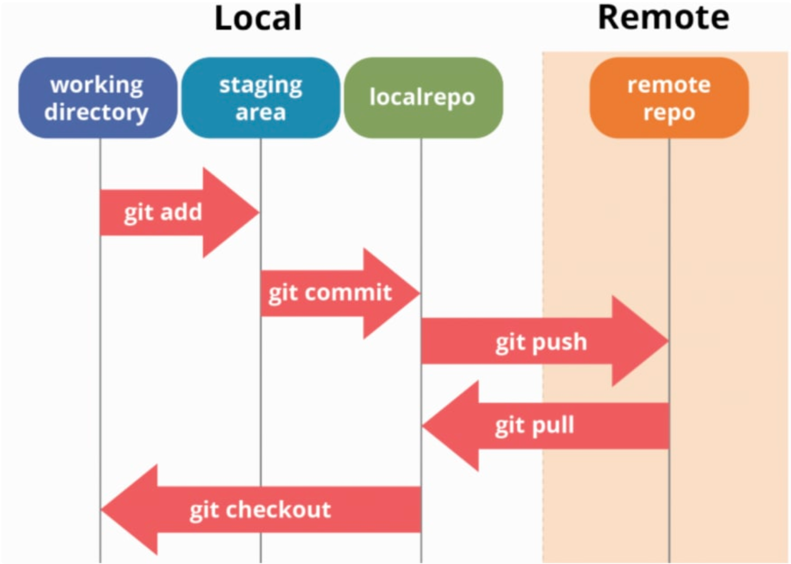

# git 특강 2일차
## git structure

### git status에 관하여
*Working directory와 Staging Area & Staging Area와 Commit의 차이*를 비교해주는 기능. 그 비교를 통하여 Stage에 오려야 하는건지, Commit에 올려야 하는 건지 파악해서 알려주는 기능을 한다.

* Mac에서 staging area 보는 법 : 해당 폴더에서 *command + shift + .* 을 하면 .git 폴더가 보인다. 그 안의 index에 저장되어 있다. 다시 보고싶지 않다면 똑같이 *command + shift + .* 으로 제거한다.

### git 사용 시 주의사항
1. **중첩으로 git init을 하면 안 된다.**
home에서 git init을 해버리면 home 폴더 자체를 git으로 관리하는 것이기 때문에, bash에 있을 때 내가 원하는 폴더에 있는 지 꼭 확인을 해보아야 한다. .git안에 또다른 .git이 있으면 안된다.
2. **git으로 이미 관리되고 있는 폴더는 위치를 이동하여 사용해도 괜찮다.**
이미 .git이 있다면 폴더명을 바꾸거나 경로를 바꾸어도 무방하다.

## git ignore
* 개념 : git으로 프로젝트를 관리할 때 꼭 필요한 것 두 가지는 README.md 와 .gitignore 이다. .gitignore 은 git으로 관리하지 않을 파일을 적어둔다.
* **gitignore 사용법**
    1. 관리하고자 하는 폴더에 .gitignore 파일을 만든다.
    2. 같은 폴더 내 작성하고자 하는 파일을 만든다.
    3. git으로 관리되지 않아야 하는 파일명을 .gitignore 적는다. 예) a.txt
    4. 주의! 파일을 git으로 관리하려고 commit 했다가 .ignore 하는 것은 안 먹힌다. 꼭 주의하기
* **프로젝트 시작 순서(반드시 이 순서대로 하도록 하자)**
    1. 로컬 저장소를 만들고자 할 때, 폴더 만들기
    2. README 와 .gitignore 만들기
    3. git init 하기
    4. 프로젝트 시작
> 관련 사이트에서 특정 프로그래밍 언어 사용 시 굳이 올라가지 않아도 될 파일을 작성해준다. 복붙을 하면 편하다! [.gitignore 관련 사이트](https://www.toptal.com/developers/gitignore)

## git clone vs git pull

- git pull : 새로운 버전을 동기화하고 싶은 경우에 사용
- git clone : remote 자체를 가지고 오고 싶은 경우에 사용(그대로 복제해서 가져온다.이때, 원격 저장소와 *연결까지 완료된 상태에서*  끌고오므로 따로 remote를 사용하여 연결하지 않아도 된다.) 
    clone = 폴더 만들고 + git init + git remote + 데이터를 가져오는 것
    `git clone [원격저장소 URL]`
    git clone 할 때에는 터미널에서 하도록 하자(.git 폴더가 이미 있는 곳에서 하면 오류가 난다.)
## git pull
​	`git pull origin master`

- **git pull에서 일어날 수 있는 상황** : 강의장에서 pull하지 않은 상태로 새로 작성하다가 pull을 하게 되면, 컴퓨터는 어떤 것이 먼저인 version인지 알 수 없다.
    - 충돌이 나니까, 우리는 두 버전 다 합칠거야! 합쳐서 새로운 버전으로 진행하자 (remote에 있던 버전 + 내가 작성한 버전)
    - 합치는 종류는 3가지. 경우에 따라 대처법이 다르다
        1. **다른 파일을 수정했을 때**
            그냥 합쳐지므로, 문제되는 부분이 없다.
        2. **같은 파일인데, 다른 곳을 수정했을 때**
            동일하게 합쳐지므로, 문제되는 부분이 없다.
        3. **같은 파일에서, 같은 곳(같은 줄)을 수정했을 때**
           겹치는 부분이 발생하므로, 컴퓨터는 어느 버전이 맞는 지 몰라 혼란스러워 한다.
           -> vscode에서는 이에 대한 해결방안을 제공한다.(Accept current change, Both change 등)
            Accept current change : 현재 변화만 반영
            Both change : 둘다 들어감