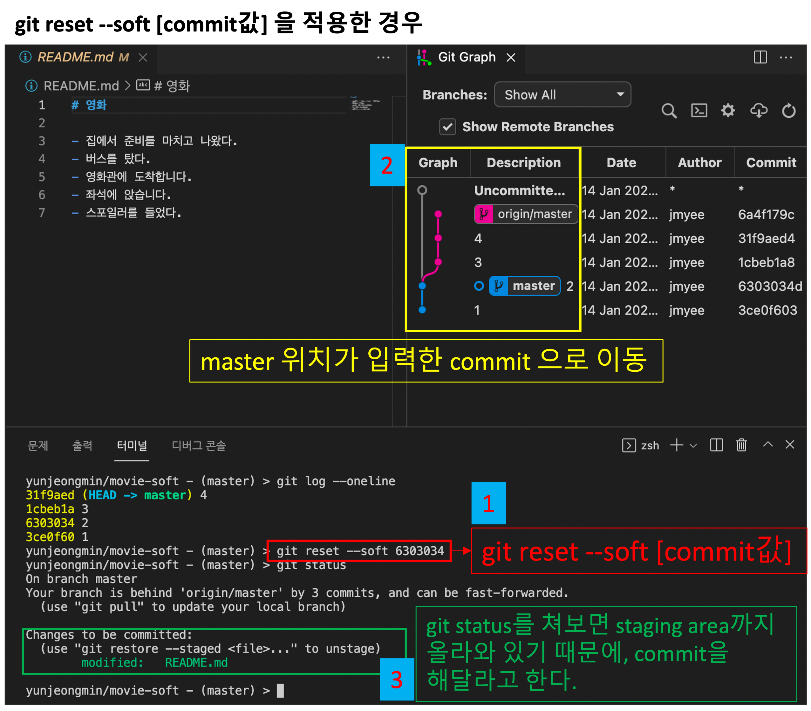
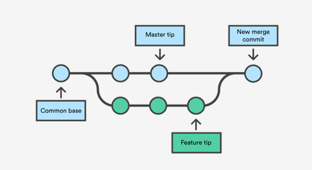

# git 특강 3일차(마지막)
*꿀팁: vs code에서 파일명 명령할 때 : day1.md의 경우 da 까지 치고 tab 누르면 자동완성

**commit 메시지에 무엇을 써야 할 지 모를 때** [참고](https://meetup.toast.com/posts/106) 

**clone 내려받을 때 폴더명 변경하는 법**   *git clone [URL] [변경할 폴더명]*

## git 심화과정

## 1. 타임머신(reset, revert)

### reset

git reset : 내가 원하는 시점의 모습을 볼 수 있다. 예) 12월 3일의 레포트를 볼 수 있다.

git reset에도 옵션이 있다. *예시) git reset --soft 31f9aed*

현재(가장 최신)로 돌아올 때에도 똑같다. 같은 옵션 + 현재(가장 최근의) 해시값을 이용하면 된다.

**(1) git reset --soft**

git soft는 Working directory와 Staging area는 그대로, Commit만 전 단계로 이동하기 때문에, git log를 찍으면 commit 해달라고 한다.

**(2) git reset --mixed**

git mixed는 기본값이라, *git reset [commit ID]*로 작성해도 된다.

Staging area에 안 올라온 상태이므로, git은 사용자에게 add . 를 해 달라고 요청한다.

**(3) git reset --hard**

Working directory, Staging area, Commits 에서 모두 제거되기 때문에 nothing to commit 으로 나온다.

**git reset의 부작용** 

1. 기존 commit ID를 지워버린다. 하지만, 복구 가능하다.(reflog 이용)

​	***git reflog* : reference log. master가 참조했던 모든 commit을 보여준다.**

2. git reset을 사용 후 github에 올린다면? 거절된다. 강제푸쉬로 github에 올렸다면 다른 사용자가 pull 받을 때 문제가 생긴다. 그러니 **reset 후 절대 github에 올리지 않는다.**

---

### revert

revert는 내가 원하는 commit만 취소할 수 있다. reset을 할 때 혼동되던 걸 revert로 해결할 수 있다.

사용법 : *git revert [취소하고자 하는 commit ID]*

1. 취소하고자 한 commit 을 지웠다고 선언

2. vim 나온다. (vim은 commit에서 메세지 작성할 때 나오는 것)

   *vim(텍스트 편집기) 들어가졌을 때 나가는 법 : Esc 누른 후,  : + wq 작성 후 Enter (write and quit)
   git commit만 썼을 때: 맨 밑에 i 누르면 삽입이 가능(insert mode)*

3. git log --oneline 해보면, 해당 버전을 취소한다는 commit 이 생긴다.(지웠다고 한 기록이 남는 것!) **log는 사라지지 않는다.(진짜로 지워지진 않는다.) + 해당 버전 취소 commit이 생긴다.**

## 2. Branch, Merge

### Branch

master는 굵은 줄기. master 말고 다른 것도 있지 않을까? 나무처럼, master에서 버전이 뻗어나갈 수 있다.

주로 협업을 할 때 사용하게 되는 방법으로, 평행우주와 같은 개념이다. 즉, branch를 만든 후 branch에서 어떤 짓을 해도, master에는 어떠한 영향도 끼치지 않는다.

**branch를 사용하는 이유**

1. master는 상용(많은 사람들이 이용)이다. 만약 master 버전에서 에러가 발생해서 해결할 때, 새로운 버전이 쌓인다. 에러를  수정하고 새로운 버전을 배포하기 전, 기업에서는 테스트 서버를 이용하여 문제가 없는 지 검수 과정을 거친다. 이때, 테스트 서버는 다른 사용자들에게 노출되지 않아야 하기 때문에 branch를 사용하여 에러를 해결, 검수하고 이 부분이 완료되면 master과 합쳐 새로운 버전을 배포한다.
2. 기본적인 기능 + 멤버십마다 다른 기능이 조금씩 추가되어있을 경우, 각자의 master를 만들어 관리하면 모두 따로 관리해야하므로 비효율적이다. 특히, 기본 공통 기능에 에러가 발생했을 경우, 한 기능에서 업데이트한 기능을 반복적으로 작업하여야 하는 불편함이 생기므로 branch를 이용하여 관리하면 더 효율적으로 관리가 가능하다. *예) 노션의 경우 요금제가 따로 있고, 각자 요금제에 따라 받는 기능이 다르다. 겹치지 않는 버전을 branch로 관리한다.*

*참고: HEAD는 지금 내가 어디 있는 지를 의미, Master는 메인 작업공간을 의미한다. HEAD -> Master 란, master 작업공간에서 HEAD가 일하고 있다는 것을 의미한다.

**branch 만들기**

*git branch : branch 목록 확인*

*git branch [branch name] : branch 생성*

*git switch [이동할 branch명]  : branch 이동*

---

### Merge

branch에서 작성이 끝나면 master에 병합을 해주어야 한다. 즉, merge는 분기된 브랜치들을 하나로 합치는 명령어이다.

**branch 병합하기**   *git merge [병합할 branch name]*

*참고 : Merge를 수행하기 전에, 메인 브랜치(master)로 switch를 해야 한다. *git switch master* 

**branch 지우기**   *git branch -d [branch]*

**branch에서 발생하는 세 가지 상황**
git pull을 했을 때 발생 할 수 있는 상황처럼, branch에서도 세 가지 상황이 나타난다.

**1. Fast-forward** : 빨리감기. 자연스럽게 합쳐치는 것

   *yunjeongmin/git-branch-practice - (master) > git merge b1
   Updating a9b789e..7f6c1d1
   **Fast-forward**
    a.txt | 1 +*
    1 file changed, 1 insertion(+)

**2. 3 way Merge** : 정상적인 병합. pull 상황에서 다른 파일 수정 or 같은파일의 다른부분 수정했을 때 합쳐지는 것과 동일

**3. Conflict** : 비정상적인 병합. 어떻게 병합할 것인지 사용자가 선택해주어야 한다.

## git 특강 세줄 요약

1. Why git, GitHub? 버전관리와 포트폴리오, 협업의 측면에서 사용한다.

2. Working directory, Staging Area, Commit의 구조를 안다.
3. Local과 Remote의 차이점과 왜 Remote가 필요한 지를 이해한다.