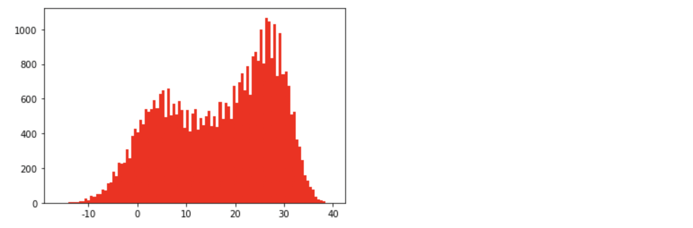

# 기상공공데이터 분석

공공데이터를 이용해서 분석 및 시각화를 하기 위해 기상청 [사이트](https://data.kma.go.kr/cmmn/main.do) 에서 서울의 기온 데이터를 받아왔다. 해당 기간 중 서울의 최고기온이 있었던 일자와 그때의 최고 기온을 알아보는 공공데이터 분석을 아래에 정리했다.

## 공공데이터 가져오기 & 분석 - 가장 기온이 높았던 날과 온도 구하기

### 1. csv 파일 열기

   *f  = open('파일명', '모드', 인코딩)*

``` python
import csv #csv를 읽는 라이브러리를 가져오기
f = open('seoul.csv', 'r', encoding = 'cp949') #'r': 읽기 전용으로 연다.
#encoding = 'cp949'의 의미: windows 한글 인코딩 방식
data = csv.reader(f, delimiter = ',')
print(data) #주소값이 나오게 된다.
f.close() 
```

​	주소값이 아닌 데이터 자체를 온전히 보고싶다면 **for문**을 사용해준다. 이때, row는 엑셀의 하나하나 값을 의미한다.

``` python
f = open('seoul.csv', encoding = 'cp949')
data = csv.reader(f) #data라는 값에 f를 읽어 넣어주기
for row in data: #data의 한 행(row)씩 읽어주기
    print(row)
f.close()
```
​	이때, 데이터는 아래와 같이 리스트 형태로 나오게 된다.

```python
['날짜', '지점', '평균기온(℃)', '최저기온(℃)', '최고기온(℃)']
['1907.10.1', '108', '13.5', '7.9', '20.7']
['1907.10.2', '108', '16.2', '7.9', '22']
['1907.10.3', '108', '16.2', '13.1', '21.3']
['1907.10.4', '108', '16.5', '11.2', '22']
['1907.10.5', '108', '17.6', '10.9', '25.4']
['1907.10.6', '108', '13', '11.2', '21.3']
['1907.10.7', '108', '11.3', '6.3', '16.1']
['1907.10.8', '108', '8.9', '3.9', '14.9']
```

​	목록의 첫 번째(날짜, 지점 등)만 보고싶다면 헤더로 지정해준다. 이 때 *next()* 함수를 사용한다.

* 첫줄 건너뛰기: *next(dataname)*

``` python
f = open('seoul.csv', encoding = 'cp949')
data = csv.reader(f)
header = next(data) #python의 pop과 비슷한 기능. 첫번째 값을 보여주고 그 다음 칸으로 커서 이동
print(header)
f.close()
```

```python
['날짜', '지점', '평균기온(℃)', '최저기온(℃)', '최고기온(℃)'] #print(header)의 결과값
```

 ### 2.  최고기온 데이터 추출하기

맨 위는 실데이터가 아니므로, next(data)로 넘겨준 뒤에 최고기온의 데이터를 뽑는다.

``` python
import csv
f = open('seoul.csv', 'r', encoding = 'cp949')
data = csv.reader(f)
header = next(data)
for row in data:
    row[-1] = float(row[-1]) 
    print(row)
f.close()
```

​	위 코드를 실행하면 아래와 같은 오류가 뜬다.

```python
ValueError                                Traceback (most recent call last)
<ipython-input-14-6003251c9f82> in <module>
      4 header = next(data)
      5 for row in data:
----> 6     row[-1] = float(row[-1])
      7     print(row)
      8 f.close()

ValueError: could not convert string to float: ''
```

​	이유는, 데이터값중에 null값이 있기 때문이다.(null값은 실수로 변환할 수 없다.) 이를 해결하기 위해서, null값이라면 인식가능한 다른 값으로 대체해준다.

```python
import csv
f = open('seoul.csv', 'r', encoding = 'cp949')
data = csv.reader(f)
header = next(data) #header라는 변수에 헤더 데이터 행을 저장
for row in data:
    if row[-1] == '':
        row[-1] = -999 #만약 맨 뒤 값이 공란(null)이라면, -999로 바꿔달라고 설정하여 오류 해결
    
    row[-1] = float(row[-1])
    print(row)
f.close()
```
아래와 같이 null값이었던 곳(1950.9.1, 1950.9.2)에 -999가 들어가서 반환되었다.
```python
['1950.8.30', '108', '24.6', '18', 32.6]
['1950.8.31', '108', '25.4', '20.1', 32.5]
['1950.9.1', '108', '', '', -999.0]
['1950.9.2', '108', '', '', -999.0]
```

기온을 다른 일자들과 돌아가면서 비교해주어야 하므로, 비교를 시행할 첫 번째 기준값을 잡아준다. 이 때, 기준값은 도출해내고자 하는 '최고기온'이 절대 될 수 없는 값으로 설정해주어야 한다.(현재는 -999로 설정을 해 주었다.)

**최고기온의 기준값 ->** max_temp =. -999

**최고기온의 날짜 기준값 ->** max_date = ''

### 3. 최종 코드

``` python
import csv
max_temp = -999 #비교할 값을 설정(이때, 최고기온을 구해야 하므로 최고기온으로 나올 수 없는 값을 설정해준다.)
max_date = '' #비교할 값을 설정
f = open('seoul.csv', 'r', encoding = 'cp949')
data = csv.reader(f)
header = next(data) #헤더 설정
for row in data : #데이터를 한 행씩 돌아가면서 비교
    if row[-1] == '' :
        row[-1] = -999 #null값이 있다면 -999로 바꿔준다.
    
    row[-1] = float(row[-1]) #비교를 위해 마지막 값(최고기온)을 실수로 바꿔주기
    
    if row[-1] > max_temp: #행의 최고기온이 max_temp보다 크다면
        max_date = row[0] #max_date에 해당하는 행의 날짜를 할당
        max_temp = row[-1] #max_temp에 해당하는 행의 최고기온을 할당
    else :
        continue #행의 최고기온이 max_temp보다 같거나 작다면 추출하지 않는다.
        
print("기상 관측 이래 서울의 최고 기온이 가장 높았던 날은 %s으로, %s도 였습니다."%(max_date, max_temp))
f.close()
```

**결과값**

기상 관측 이래 서울의 최고 기온이 가장 높았던 날은 *2018.8.1*으로, *39.6*도 였습니다.

## 데이터 시각화(matplotlib 이용)

matplotlib은 시각화를 할 때 가장 많이 사용하는 라이브러리이며, 인공지능 분야에서 많이 사용되고 있다. import 명령어를 통해 가져오도록 하자

### 그래프 제목

``` python
import matplotlib.pyplot as plt #matplotlib에 있는 pyplot을 사용하겠다.
plt.title('plotting') #그래프의 제목 삽입. plt.title('그래프이름') 
plt.plot([1, 2, 3, 4],[10, 20, 30, 40]) #각각 x,y축으로 들어간다. 갯수가 서로 다르면 Error 발생
plt.show() #그래프 보기
```

* 그래프 이름 : *plt.title('graph name')*

\+ 그래프의 제목을 삽입할 때, 한국어를 입력하면 파일이 깨져서 보인다. 이유는 기본으로 세팅되어있는 폰트가 한국어를 지원하지 않기 때문이다. 이때, Mac에서 `plt.rcParams['font.family'] = 'AppleGothic'`  코드를 추가해 실행하면 아래와 같이 한국어를 제목으로 사용할 수 있다.

Windows의 경우 한글 이름 사용하기: `plt.rcParams['font.family'] = 'Malgun Gothic'` 


### 그래프 범례, 색, 선 유형

그래프의 범례 표시, 색상 변경, 실선 혹은 점선으로 만드는 것도 가능하다. 

* 선 색 설정하기: *color = 'linecolor'* 혹은 *'linecolor'*
* 범례 이름 설정: *label = 'name'*
* 그래프상에 범례 표시하기: *plt.legend()*

``` python
import matplotlib.pyplot as plt
plt.title('color') #제목을 color로 설정하기
plt.plot([10, 20, 30, 40], color = 'skyblue', label = 'skyblue') #범례, 선 색은 하늘
plt.plot([40, 30, 20, 10], 'pink', label = 'pink') #범례, 선 색은 분홍
plt.legend() #범례 보여주기
plt.show()
```


* dash선으로 설정하기: *linetsyle = '--'*
* 점선으로 설정하기: *linestyle = ':'*

``` python
import matplotlib.pyplot as plt
plt.title('linestyle') #제목설정
plt.plot([10, 20, 30, 40], color = 'r', linestyle = '--', label = 'dashed')
plt.plot([40, 30, 20, 10], color = 'g', ls = ':', label = 'dotted')
plt.legend()
plt.show()
```


특정 도형으로도 그래프를 표시할 수 있다. 이 때에는 r, g 등 색상 뒤에 .이나 ^를 붙여서 사용해주도록 한다.

* 동그라미로 표시하기: *.*
* 삼각형으로 표시하기: *^*

``` python
import matplotlib.pyplot as plt
plt.title('marker') #그래프 제목 = marker
plt.plot([10, 20, 30, 40],'r.', label = 'circle') #빨간색 동그라미로 표시
plt.plot([40, 30, 20, 10],'g^', label = 'triangle') #초록색 삼각형으로 표시
plt.legend() #레이블 표시
plt.show()
```


### 기상공공데이터 시각화하기

위에서 진행했던 기상공공데이터를 다시 보도록 하자. 지금까지의 데이터에 기록된 서울의 최고기온을 그래프로 시각화하고자 한다. 우선, 시각화를 진행하기 위해서는 최고기온을 모두 포함한 하나의 리스트를 만들어주어야 한다. 그렇게 하기 위해 아래의 코드를 작성해주어야 한다.

``` python
#최고기온을 하나의 리스트로 모으기(그래프를 만들어보기 위해)
import csv
f = open('seoul.csv', 'r', encoding = 'cp949')
data = csv.reader(f)
next(data) #첫번째 행 헤더값 처리
result = [] #최고기온 값을 넣을 공간을 만들어 준다.

for row in data: #데이터를 한줄씩 읽기
    if row[-1] != '': #최고기온이 null값이 아니라면
        result.append(float(row[-1])) #result 리스트에 최고기온을 실수처리해서 추가해주어라
print(result)
```

결과값은 아래와 같이 추출된다.

``` python
[20.7, 22.0, 21.3, 22.0, 25.4, 21.3, 16.1, 14.9, 21.1, 24.1, 20.4, 17.4, 21.3, 20.6, 20.9, 20.2, 21.6, 20.9, 21.3, 22.7, 19.9, 19.6, 16.3, 17.1, 18.7, 18.2, 20.7, 19.6, 20.0, 20.1, 20.3, 21.3, 21.1, 11.1, 13.6, 17.0, 18.1, 12.4, 9.4, 11.9, 13.2, 13.4, 14.9, 16.4, 15.2, 17.6, 12.6, 11.7, 6.7, 4.3, 7.1, 6.2, 11.2, 9.9, 5.9, -0.7, 1.5, 1.9, 2.0, 2.9, -2.4, 1.4, 3.4, 6.1, 1.3, 2.6, 5.8, 1.9, 6.6, 8.1, 4.3, 0.6, 3.8, 9.0, 6.4, -5.1, -2.4, -2.1, -0.4, -0.2, 1.9, -8.1, -10.2, -9.4, 0.9, 6.8, 6.4, -0.7, -1.9, -4.4, -6.1, -2.1, -1.3, -3.0, -2.9, -1.7, -0.1, 2.9, -1.2, -0.9, 2.0, 3.3, 4.8, 4.5, 4.7, 0.1, 0.9, -4.5, -3.6, 2.8, 2.8, 2.3, -6.1, -5.1, -2.7, 0.1, 0.3, -0.6, 0.0, -1.3, 0.8, 0.8, 6.2, 1.6, -0.2, -5.4, -4.1, -5.5, -5.7, -3.7, 1.3, -4.1, -2.5, -2.8, -1.2, 1.3, 2.3, 2.0, -1.4, -1.6, 0.3, 5.5, 7.3, 5.1, 5.4, 2.7, 1.7, 0.8, 4.1, 8.4, 6.3, 5.6, 4.0, 0.1, 4.9, 4.0, 7.9, 7.9, 2.2, 1.9, 1.5, 1.5, 1.8, 2.6, 3.8, 6.7, 11.8, 13.5, ... ]
```

이 데이터를 시각화하기 위해 아래의 코드를 작성해주었다.

``` python
plt.plot(result, 'r') #result를 그래프로 나타내주기, 선의 색은 레드
plt.show()
```


위와 같이 4만개가 넘는 데이터(x축)의 최고기온들(y축)이 나타난다.

#### 특정 날짜의 매년 최고기온이 궁금하다면

특정 날짜의 최고기온이 매년 어떻게 변화했는 지 알고싶다면, 기존에 했던 코드와 나머지는 같되, 측정 날짜가 담긴 row[0]번째에서 월과 일을 추출하여 조건에 추가해주면 된다. split() 명령어는 띄어쓰기를 기준으로 나누어주는데, 괄호 안에 사용자가 지정하고자 하는 문자를 넣어주면 해당 문자를 기준으로 데이터가 나뉘어지게 된다. Mac의 경우 날짜는 '1998.1.20' 처럼 온점(.)으로 년, 월, 일이 나뉘어 있었으므로 split('.')을 사용해주었다.

예시)` row[0].split('.')[1] == '10'  ` 

: 행의 첫 번째 값이 '1980.11.21'일 때, row[0].split('.') 을 실행하면 [1980, 11, 21]을 담은 리스트로 추출이 된다. 원하는 값은 월과 일 이므로, 리스트 중에서도 두번째와 세번째 값이다. `row[0].split('.')[1]`을 실행하면 **11**이 나오게 되며, `row[0].split('.')[2]`을 실행하면 **21**이 나온다.

``` python
import csv
import matplotlib.pyplot as plt
f = open('seoul.csv', 'r', encoding = 'cp949')
data = csv.reader(f)
next(data) #첫번째 행 헤더값 처리
result = []

for row in data:
    if row[-1] != '':
        if row[0].split('.')[1] == '10' and row[0].split('.')[2] == '22': 
          #매년 10월 22일의 데이터만 담겠다. 최고기온이 null값이 아니면서 10월 22일의 값이라면
            result.append(float(row[-1])) #result에 해당 최고기온을 넣어준다.
plt.plot(result, 'hotpink') #result값을 그래프로 나타내기, 색상은 hotpink
plt.show()
```


일자는 동일하게 하되, 두개의 그래프를 동시에 나타낼 수도 있다.

``` python
#최저기온와 최고기온 함께 나타내기
import csv
import matplotlib.pyplot as plt
f = open('seoul.csv', 'r', encoding = 'cp949')
data = csv.reader(f)
next(data) #첫번째 행 헤더값 처리
result = []
result2 = []

for row in data:
    if row[-1] != '' and row[-2] != '': #최고기온과 최저기온 데이터가 null인 값을 제외하고 더한다.
        if row[0].split('.')[1] == '10' and row[0].split('.')[2] == '22': #매년 10월 22일의 최고기온 데이터만 담겠다.
            result.append(float(row[-1]))
            result2.append(float(row[-2]))
plt.plot(result, 'hotpink', label = '최고기온')
plt.plot(result2, 'skyblue', label = '최저기온')
plt.legend() #레이블 표시
plt.show()
```


### 히스토그램

선 그래프가 아닌, 히스토그램으로도 그래프를 나타낼 수 있다.

- 히스토그램: *plt.hist()*

``` python
import matplotlib.pyplot as plt
plt.hist([1,1,2,3,4,5,6,6,6,7,8,10])
plt.show()
```


#### 주사위 굴려보기: 랜덤함수 이용

랜덤함수를 이용해서 주사위 던지기를 하고, 결과값을 히스토그램으로 나타내보자.

- 랜덤함수

  ``` python
  import random #랜덤함수 호출
  print(random.randint(1, 100)) #randint는 랜덤값을 정수로 나타내준다. 1부터 100까지 정수를 랜덤으로 프린트한다.
  ```
  
- bins : 히스토그램의 가로축 구간의 개수를 지정

**주사위를 다섯 번 던져 나온 값을 히스토그램으로 만들기**

``` python
import matplotlib.pyplot as plt
import random #랜덤함수 호출
dice = []
for i in range(5): #주사위 던지기 5번 반복
    dice.append(random.randint(1,6)) #dice에 1-6 중 랜덤하게 나온 정수를 집어넣는다.
print(dice)

plt.hist(dice, bins = 6) #가로축 구간의 개수는 6개
plt.show()
```


#### 기온 공공 데이터를 히스토그램으로 나타내기

위의 방법을 사용하면 기존의 최고기온 데이터를 히스토그램으로 나타낼 수 있다.

``` python
import csv
import matplotlib.pyplot as plt

f = open('seoul.csv', 'r', encoding = 'cp949')
data = csv.reader(f)
next(data)
result = []

for row in data:
    if row[-1] != '':
        result.append(float(row[-1]))
        
plt.hist(result, bins = 100, color = 'r') #가로 축 구간은 100개
plt.show()
```



**1월과 10월의 최고기온을 히스토그램으로 나타내기**

``` python
import csv
import matplotlib.pyplot as plt

f = open('seoul.csv', 'r', encoding = 'cp949')
data = csv.reader(f)
next(data)
october = []
jan = []

for row in data:
    month = row[0].split('.')[1]
    if row[-1] != '':
        if month == '10':
            october.append(float(row[-1]))
        elif month == '1':
            jan.append(float(row[-1]))
        
plt.hist(october, bins = 100, color = 'skyblue', label = 'Oct')
plt.hist(jan, bins = 100, color = 'pink', label = 'Jan')
plt.legend() #범례 보이도록 설정
plt.show()
```
