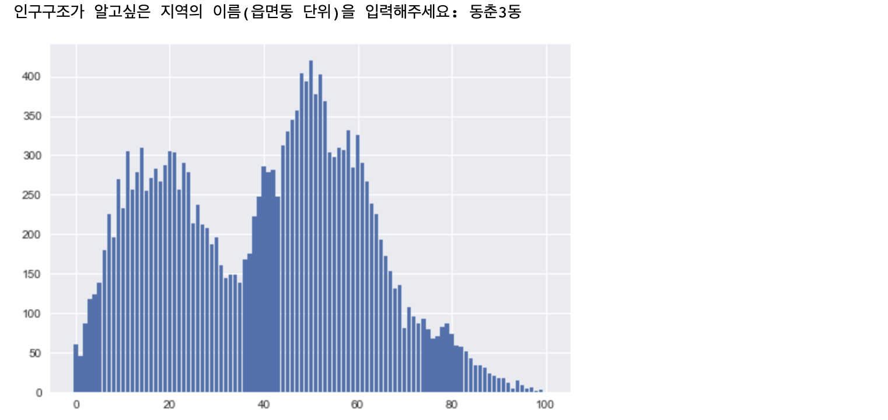
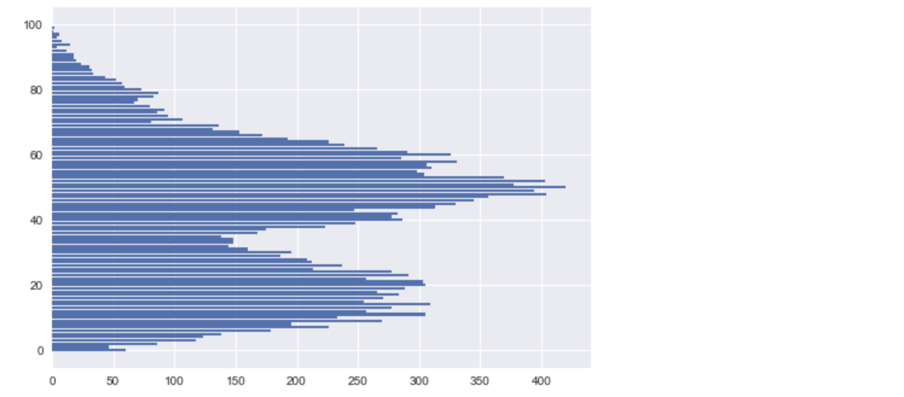

# 기온공공데이터, 인구데이터 분석

들어가기 전에: Matplotlib 튜토리얼 참고 [사이트](https://wikidocs.net/book/5011) 

## 1. 박스 플롯

박스 플롯은 데이터의 최댓값, 최솟값, 상위 1/4, 2/4, 3/4 에 위치한 값 등을 보여주는 그래프이다. 랜덤 함수를 이용해서 박스 플롯을 그려보면 다음과 같이 나온다.

- *plt.boxplot()*

``` python
import matplotlib.pyplot as plt #matplotlib의 pyplot을 가져온다.
import random #랜덤 함수를 가져온다.
result = []
for i in range(13): #13번 반복
    result.append(random.randint(1, 1000)) #1부터 1000까지 랜덤하게 정수 추출
print(sorted(result)) #정렬된 리스트로 반환

plt.boxplot(result) #result리스트를 박스플롯으로 나타내겠다.
plt.show()
```


### 박스 플롯을 이용해 기상공공데이터 보기

Day04 파일에서 진행했던 기온공공데이터를 아래처럼 박스 플롯으로도 만들 수 있다. 박스 플롯을 사용하면 최고기온의 최대, 최소값을 한눈에 볼 수 있다.

``` python
import csv #csv 파일 읽기 위해 import 시행
f = open('기상청/seoul.csv', 'r', encoding = 'cp949') #파일 상대경로 및 파일명, 읽기모드, 인코딩
data = csv.reader(f)
next(data) #첫행을 넘겨 실데이터만 읽을 수 있도록 처리
result = []

for row in data : 
    if row[-1] != '': #최고기온이 null값이 아니라면 result 리스트에 추가한다.
        result.append(float(row[-1])) #최고기온을 실수처리해 리스트에 추가
        
import matplotlib.pyplot as plt #그래프 그리기위해 matplotlib 불러오기
plt.boxplot(result)
plt.show()
```


#### 1, 8월의 데이터를 함께 보고 싶다면

위와 같은 방법으로 1, 8월의 데이터를 함께 볼 수도 있다. 하지만, 위의 방법 그대로 처리할 경우에 박스 플롯은 하나의 박스플롯에 겹치게 나오게 된다. 그러므로, *plt.boxplot을 쓸 때 리스트 처리[] 를 해주어야 한다.*

``` python
import csv
f = open('기상청/seoul.csv', 'r', encoding = 'cp949')
data = csv.reader(f)
next(data)
Jan = [] #1월의 최고기온 담기
Aug = [] #8월의 최고기온 담기

for row in data : 
    if row[-1] != '': #최고기온이 null값이 아니라면 리스트에 추가한다.
        if row[0].split('.')[1] == '1': #'2019.1.28'과 같이 써있는 row[0]에서 월 추출
            Jan.append(float(row[-1])) #1월이라면 Jan리스트에 추가
        if row[0].split('.')[1] == '8':
            Aug.append(float(row[-1])) #8월이라면 Aug리스트에 추가

import matplotlib.pyplot as plt
plt.boxplot([Jan, Aug]) #박스플롯이 옆으로 나오도록 리스트[] 처리
plt.show()
```


#### 1월부터 12월의 최고기온 데이터를 보고 싶다면

모든 월의 최고기온 데이터를 박스 플롯으로 보고싶다면? 위와 같이 if문을 써주어서 ==1 부터 ==12까지 해줄 수도 있지만, 그렇게 진행하게 되면 코드가 너무 길어지게 된다. 또한, Jan부터 Dec까지 변수를 12개나 만들어주어야해서 번거로운 작업이 될 수도 있다. 이를 해결하기 위해, 1월부터 12월을 list in list 형태로 나타내주고, 반복문으로 1월부터 12월 값을 append 해 줄 수 있다.

``` python
import csv
f = open('기상청/seoul.csv', 'r', encoding = 'cp949')
data = csv.reader(f)
next(data)
month = [[], [], [], [], [], [], [], [], [], [], [], []] #list in list 형태

for row in data : 
    if row[-1] != '': #최고기온이 null값이 아니라면 리스트에 추가한다.
        for n in range(12): #12번 반복
            if int(row[0].split('.')[1]) == n+1: #추출한 월이 n+1과 같다면
                month[n].append(float(row[-1])) #n번째 리스트에 넣어준다.
        
import matplotlib.pyplot as plt
plt.boxplot(month)
plt.show()
```


## 2. 인구공공데이터 프로젝트

이번에는 인구공공데이터를 추출해와서 데이터 시각화를 진행한다. 인구 공공데이터는 [행정안전부](https://jumin.mois.go.kr/index.jsp)에서 가져왔으며, 전국의 2021년 12월 연령별 인구현황(전국, 전체읍면동현황, 연령 구분 단위 1세, 만 0세~100세 이상)을 가져왔다. 참고로, 데이터는 아래 형식으로 저장되어 있다.


### 특정 지역의 인구 데이터 뽑기

위의 표에서 특정 지역(여기에선 '신도림'으로 한다.)의 인구데이터를 뽑으려면 어떻게 해야 할까? 위와 같은 엑셀 파일로 보았을 때 행정구역은 1번째 열로 확인이 가능하며(리스트 기준 0번째), 데이터의 4번째 열부터(리스트 기준 3번째) 본 데이터가 나온다는 것을 알 수 있다. 그렇다면 '신도림'은 1열에서, 데이터들은 4번째 열부터 리스트에 넣어주면 도출할 수 있을 것이다.

``` python
f = open('age.csv', 'r', encoding = 'cp949')
data = csv.reader(f)
result = []

for row in data :
    if '신도림' in row[0]: #신도림 지역의 데이터 뽑기
        for i in row[3:]: #3열부터 0세~100세 이상의 데이터가 있으므로 3열부터 추출
            result.append(int(i)) #result 리스트에 해당 데이터 넣기
print(result)
```

```python
#print(result)의 결과값은 아래와 같다. 차례대로 0세, 1세, ... 100세 이상을 나타낸다.
[281, 274, 311, 296, 316, 383, 430, 387, 381, 385, 414, 392, 365, 395, 362, 320, 337, 308, 323, 349, 352, 425, 361, 376, 429, 457, 461, 443, 465, 474, 527, 473, 554, 625, 648, 609, 624, 651, 699, 702, 738, 702, 721, 630, 643, 593, 612, 654, 660, 603, 618, 582, 561, 520, 458, 472, 511, 499, 416, 483, 472, 480, 452, 456, 421, 363, 455, 368, 349, 338, 236, 275, 245, 260, 252, 169, 142, 137, 131, 153, 122, 113, 95, 91, 75, 71, 54, 57, 31, 36, 20, 17, 14, 15, 13, 8, 8, 3, 6, 2, 4]
```

#### 꺾은선 그래프로 보기(plt.style.use)

위에서 도출한 데이터를 꺾은선 그래프로 파악해보자. 이때, matplotlib에서는 다양한 형태의 그래프 스타일을 제공한다.  *plt.style.use('style name')*을 통해 지정할 수 있다.

- *plt.style.use('style name')* 

- *print(plt.style.available)* : 제공하는 그래픽 스타일 이름 확인

  ['Solarize_Light2', '_classic_test_patch', 'bmh', 'classic', 'dark_background', 'fast', 'fivethirtyeight', 'ggplot', 'grayscale', 'seaborn', 'seaborn-bright', 'seaborn-colorblind', 'seaborn-dark', 'seaborn-dark-palette', 'seaborn-darkgrid', 'seaborn-deep', 'seaborn-muted', 'seaborn-notebook', 'seaborn-paper', 'seaborn-pastel', 'seaborn-poster', 'seaborn-talk', 'seaborn-ticks', 'seaborn-white', 'seaborn-whitegrid', 'tableau-colorblind10']

``` python
import matplotlib.pyplot as plt
plt.style.use('ggplot') #원하는 그래픽스타일 지정
plt.plot(result)
plt.show()
```


#### 입력값을 받아 해당 지역의 연령별 분포 확인하기

사용자가 궁금한 지역의 값을 입력받아 연령별 분포를 확인할 수도 있다. '신도림'의 자리에 input값을 삽입해주면 되는 것이다. input값은 문자열로 출력되므로, 따로 캐스팅 처리를 해 줄 필요는 없다.

``` python
import csv
f = open('age.csv', 'r', encoding = 'cp949')
data = csv.reader(f)
result = []
search = input("인구구조가 알고싶은 지역의 이름(읍면동 단위)을 입력해주세요: ")

for row in data :
    if search in row[0]: #입력한 지역의 데이터 뽑기
        for i in row[3:]: #3열부터 0세~100세 이상의 데이터가 있으므로 3열부터 추출
            result.append(int(i)) #result 리스트에 해당 데이터 넣기

import matplotlib.pyplot as plt
plt.style.use('seaborn') #원하는 그래픽스타일
plt.plot(result)
plt.show()
```

위의 코드를 실행하면 `"인구구조가 알고싶은 지역의 이름(읍면동 단위)을 입력해주세요: "`가 나오며, 원하는 지역을 입력했을 때 아래의 그래프가 나오게 된다.


### 히스토그램

이번에는 히스토그램을 사용해보자. 사용법은 큰 차이가 없으니 간단하게 아래의 코드를 보며 이해하면 된다.

- *plt.bar('x축 값', 'y축 값')*

``` python
import matplotlib.pyplot as plt
plt.bar([0,1,2,4,6,10], [1,2,3,5,6,7]) #x축과 y축 설정
plt.show()
```


x축과 y축의 값을 설정할 때에는 범위를 나타내는 *range*를 통해서도 나타내줄 수 있다.

```python
plt.bar(range(6), [1,2,3,5,6,7]) #range를 사용해서도 할 수 있다.
plt.show()
```


#### 히스토그램으로 인구데이터 나타내기

히스토그램을 이용해서 인구 데이터를 나타내보자. 과정은 위와 같으므로 생략한다.

``` python
import csv
f = open('age.csv', 'r', encoding = 'cp949')
data = csv.reader(f)
result = []
search = input("인구구조가 알고싶은 지역의 이름(읍면동 단위)을 입력해주세요: ")

for row in data :
    if search in row[0]: #입력한 지역의 데이터 뽑기
        for i in row[3:]: #3열부터 0세~100세 이상의 데이터가 있으므로 3열부터 추출
            result.append(int(i)) #result 리스트에 해당 데이터 넣기

import matplotlib.pyplot as plt
plt.bar(range(101), result) #x축은 101개, y축은 result값
plt.show()
```



#### 수평 막대로 나타내고 싶다면

위와 같은 수직 막대가 아닌 수평 막대로 나타내고 싶다면? *plt.bar*를 *plt.barh*로 바꿔주면 된다.

- *plt.barh('x축', 'y축')*

``` python
plt.barh(range(101), result) #수평막대로 표현하기
plt.show()
```



### 항아리 모양 그래프 그리기 - 남녀 인구데이터 활용

이번에는 남녀 구분까지 되어있는 데이터를 + 수평 막대를 활용하여 항아리 모양 그래프로 만들어볼 것이다. 추출한 데이터는 아래와 같은 형식으로 본 데이터는 4번째 열에서부터 시작한다.' 남 100세이상'이 끝난 후에는 ''여 총 인구수'' 및 연령구간 인구수가 나온다. 우리가 원하는 남 0세~100세 이상, 여 0세~100세 이상을 구하기 위해서는 아래와 같이 코드를 작성해야 한다. 아래에서는 신도림 지역의 성별, 연령별인구를 알아본다.


``` python
#항아리 모양 그래프 그리기: 남녀별 인구데이터 활용하기 - 성별&나이별 데이터 추출하기
import csv
f = open('gender.csv', 'r', encoding = 'cp949')
data = csv.reader(f)
m = [] #남성 데이터를 담을 리스트
f = [] #여성 데이터를 담을 리스트

for row in data:
    if '신도림' in row[0]: #신도림 지역에 해당하는 자료
        for i in range(0, 101): #0세부터100세이상까지 101개가 있으므로 101번 반복
            m.append(int(row[i+3])) #3번째 열부터 삽입. 앞부터 101개
            f.append(int(row[-(i+1)])) #맨 뒤부터 삽입. 뒤부터 101개를 진행하여 여자 전체 인구수는 안들어가게 된다.
        f.reverse #뒤에서부터 추출했으므로 reverse를 해야 0~100세이상 값으로 나온다.
```

위와 같이 데이터를 추출한 뒤, 데이터를 항아리모양으로 추출해야 하는데, 위의 추출값을 그대로 사용하게 되면 남, 여 데이터가 겹치게 된다. y축인 인구수 데이터가 겹치기 때문이다. 이를 해결하기 위해 우리는 남성 데이터의 추출값을 (-)로 표시해 줄 것이다. 코드를 다시 작성하면 아래와 같다.

``` python
import csv
f = open('gender.csv', 'r', encoding = 'cp949')
data = csv.reader(f)
m = []
f = []

for row in data:
    if '신도림' in row[0]:
        for i in range(0, 101):
            m.append(-int(row[i+3])) #그래프 안겹치도록 (-) 처리
            f.append(int(row[-(i+1)])) 
        f.reverse 

import matplotlib.pyplot as plt
plt.barh(range(101), m)
plt.barh(range(101), f)
plt.show()
```


위 그래프는 -100, -200등의 값이 깨져서 나온다. 또한 제목과 레이블이 없어 어떤 게 남성이고 어떤 게 여성인지 구분이 어렵다. 이 시각화한 그래프를 조금 더 다듬고 싶다면 아래와 같이 작성을 해주면 된다.

``` python
plt.rcParams['font.family'] = 'AppleGothic' #한국어 폰트 사용
plt.rcParams['axes.unicode_minus'] = False #(-)값 깨짐현상 해결
plt.title('신도림 지역의 남녀 성별 인구분포') #그래프 제목 설정
plt.barh(range(101), m, label = '남성')
plt.barh(range(101), f, label = '여성')
plt.legend() #레이블(남성, 여성) 표시
plt.show()
```


