# Seaborn, Folium을 통한 데이터 시각화와 웹 크롤링

## 1. seaborn

seaborn은 matplotlib을 기반으로 다양한 색상 테마와 통계용 차트 등의 기능을 제공하는 패키지다. 샘플 데이터인 titanic을 데이터셋으로 불러와서 seaborn을 연습해보았다. 불러온 titanic 데이터의 대략적인 구조와 정보는 아래와 같다.

- *sns.load_dataset('데이터명')* : seaborn에서 데이터 불러오기

``` python
import seaborn as sns
titanic = sns.load_dataset('titanic')

print(titanic.head())
print(titanic.info())
```

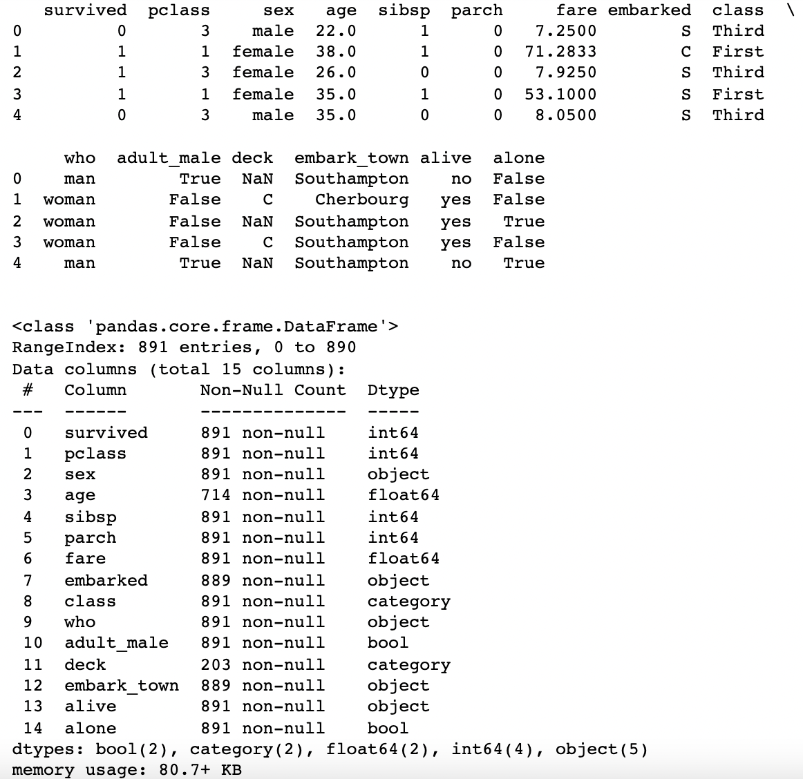

### 그래프의 종류

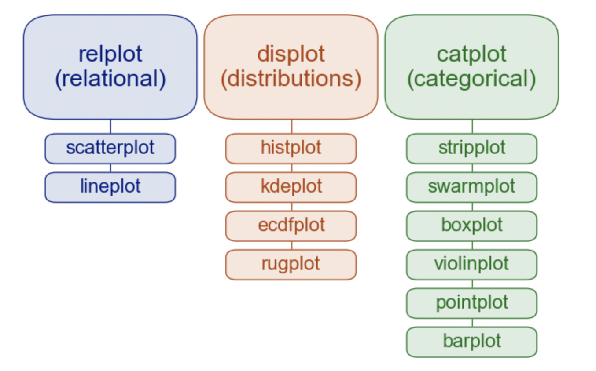

#### - regplot

regplot은 scatter plot와 line plot를 함께 볼 수 있는 데이터 시각화 방법이다. seaborn을 사용해서 데이터를 나타내보고자 한다. 시각화에 사용된 코드는 아래와 같다.

- *sns.set_style()* : seaborn에서 제공하는 기본 테마 설정으로,`darkgrid, whitegrid, dark, white, ticks` 가 있다. 기본값은 `darkgrid`로 설정되어 있다.
- *plt.figure(fig size = (가로, 세로))* : 그래프의 사이즈를 조절할 수 있는 함수. 단위는 inch
- *subplot* : 한 캔버스를 행, 열로 나눠서 각 구역마다 원하는 그래프가 나올 수 있도록 해주는 함수
- *fit_reg = True* : 선형회귀선 표시. 표시하고 싶지 않다면 *fit_reg = False* 

``` python
import matplotlib.pyplot as plt
import seaborn as sns
titanic = sns.load_dataset('titanic')

sns.set_style('darkgrid') #스타일 테마 설정

#figsize(가로길이,세로길이), 그래프 객체 생성(figure에 2개의 서브 플롯 생성)
fig = plt.figure(figsize = (15, 5))
ax1 = fig.add_subplot(1,2,1) #1행 2열의 1번째 칸
ax2 = fig.add_subplot(1,2,2) #1행 2열의 2번째 칸

#선형회귀선 표시(fit_reg = True)
sns.regplot(x = 'age', y = 'fare', data = titanic, ax = ax1)

#선형회귀선 미표시(fit_reg = False)
sns.regplot(x = 'age', y = 'fare', data = titanic, ax = ax2, fit_reg = False)

plt.show()
```

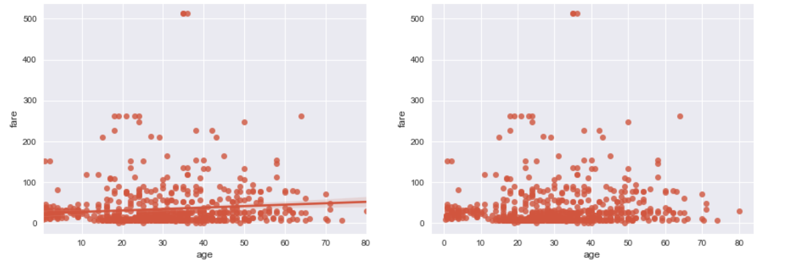

#### - distplot

distplot함수는 히스토그램과 커널 밀도 표시를 동시에 해 줄 수 있다. 둘중 하나만 보여주고 싶다면 보여주고싶지 않은 그래프를 *False* 처리해주면 된다.

- *hist = False* : 히스토그램(histogram) 보여주지 않기
- *kde = False* : 커널 밀도(kernel density) 보여주지 않기

``` python
import matplotlib.pyplot as plt
import seaborn as sns
titanic = sns.load_dataset('titanic')

fig = plt.figure(figsize = (15, 5))
ax1 = fig.add_subplot(1,3,1)
ax2 = fig.add_subplot(1,3,2)
ax3 = fig.add_subplot(1,3,3)

sns.distplot(titanic['fare'], ax = ax1)
sns.distplot(titanic['fare'], hist = False, ax = ax2) #히스토그램 나타내지 않기
sns.distplot(titanic['fare'], kde = False, ax = ax3) #커널 밀도 그래프 표시하지 않기

ax1.set_title('titanic fare - hist/ked')
ax2.set_title('titanic fare - ked')
ax3.set_title('titanic fare - hist')

plt.show()
```

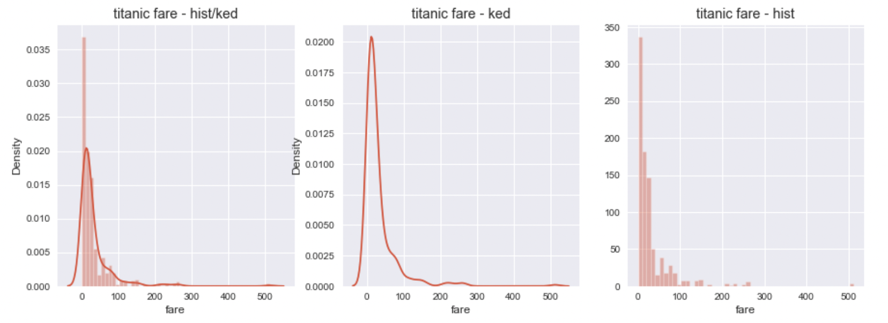

#### - heatmap

heatmap은 집계한 값에 비례해 색을 다르게 표시하여 2차원으로 자료를 시각화하는 기능이 있다. seaborn은 데이터가 2차원 피벗 테이블 형태의 DataFrame으로 집계가 되어 있으면 sns.heatmap() 함수로 간단하게 히트맵을 그려준다.

- *데이터명.pivot_table(index = '행', columns = '열', values = '데이터값' )* : 아래 예시 기준, 'sex'가 행이고 'class'가 열, 'size'가 데이터인 피벗 테이블을 만들겠다는 의미
- *aggfunc = ''* : 데이터 집계 기능을 하는 옵션, 어떤 데이터를 쓸 건지 지정
- *annot = True* : 데이터의 값을 그래프에 표시. 표시하고 싶지 않다면 *annot = False* 
- *fmt = ''* : 데이터의 값을 표시할 때, 어떤 형태로 나타낼 것인지를 표시. *fmt = 'd'*는 정수형으로 나타내겠다는 의미이다.
- *cmap 참고* : `YIGnBu, RdYlGn_r` 등이 있다.

``` python
import matplotlib.pyplot as plt
import seaborn as sns
table = titanic.pivot_table(index = ['sex'], columns = ['class'], aggfunc = 'size') 
#aggfunc : 여기서는 사이즈를 기준으로 하겠다는 뜻

sns.heatmap(table, annot = True, fmt = 'd', cmap = 'YlGnBu', linewidth = .5, cbar = False)

plt.show()
```

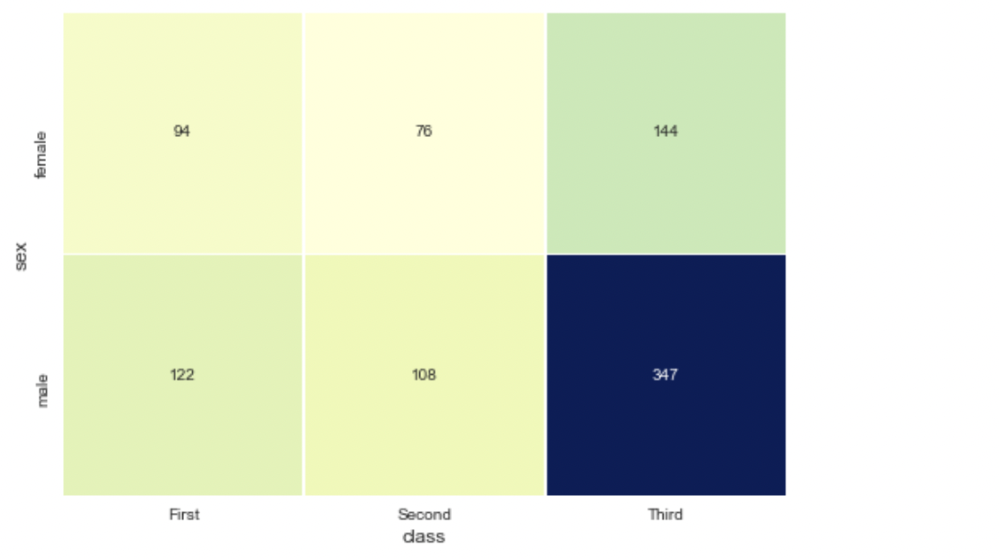

#### - strip plot, swarm plot

범주형 데이터의 산점도를 구하기 위해서는 stripplot과 swarmplot을 사용해줄 수 있다. **stripplot**은 데이터 포인트가 중복되어 범주별 분포를 그려주는 그래프이다. 이에 반해, **swarmplot**은 데이터의 분산까지 고려해, 데이터 포인트가 서로 중복되지 않도록 그려주게 된다. 즉, 데이터가 퍼져 있는 정도까지 입체적으로 보여주는 것이다.

- *ax*에는 matplotlib의 그래프(Axes) 객체를 전달한다.

``` python
import matplotlib.pyplot as plt
import seaborn as sns

titanic = sns.load_dataset('titanic')
sns.set_style('whitegrid')

fig = plt.figure(figsize = (15, 5))
ax1 = fig.add_subplot(1,2,1)
ax2 = fig.add_subplot(1,2,2)

sns.stripplot(x = 'class', y = 'age', data = titanic, ax = ax1) #ax1이라는 Axes 객체에 그래프를 그리겠다.
sns.swarmplot(x = 'class', y = 'age', data = titanic, ax = ax2)

ax1.set_title('Strip plot')
ax2.set_title('Swarm plot')

plt.show()
```

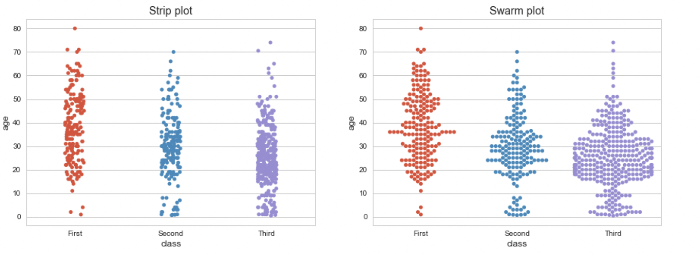

#### - boxplot, violinplot

boxplot은 이전에 설명한 적이 있는 관계로 따로 설명은 하지 않겠다. **viloinplot**은 박스 플롯 + 커널 밀도 그래프가 합쳐진 형태의 그래프를 의미한다.

``` python
#박스 플롯, 바이올린 그래프
import matplotlib.pyplot as plt
import seaborn as sns

titanic = sns.load_dataset('titanic')
sns.set_style('whitegrid')

fig = plt.figure(figsize = (15, 10))
ax1 = fig.add_subplot(2,2,1)
ax2 = fig.add_subplot(2,2,2)
ax3 = fig.add_subplot(2,2,3)
ax4 = fig.add_subplot(2,2,4)

sns.boxplot(x = 'alive', y = 'age', data = titanic, ax = ax1)
sns.boxplot(x = 'alive', y = 'age', hue = 'sex', data = titanic, ax = ax2)
sns.violinplot(x = 'alive', y = 'age', data = titanic, ax = ax3)
sns.violinplot(x = 'alive', y = 'age', hue = 'sex', data = titanic, ax = ax4)

plt.show()
```

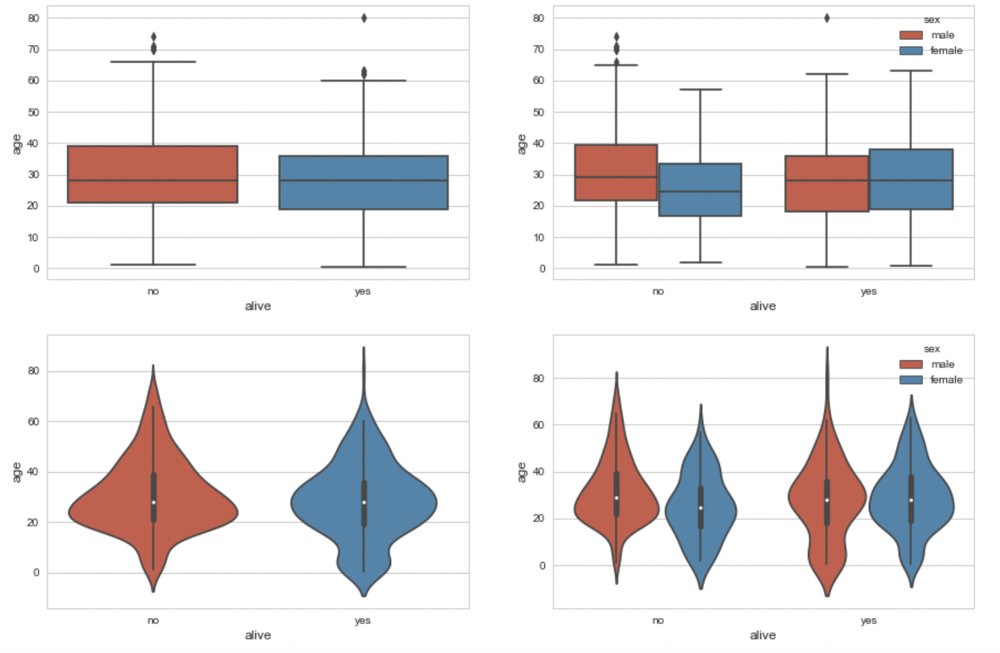

#### - 여러가지 막대그래프

- *hue = ''* : 카테고리 내 다른 범주를 구분하여 나타낼 수 있다. 예를 들어, class 데이터의 그래프를 그리는 데 남녀도 구분해주고 싶다면 *hue = 'sex'*로 넣어주면 된다.

``` python
import matplotlib.pyplot as plt
import seaborn as sns

titanic = sns.load_dataset('titanic')
sns.set_style('whitegrid')

fig = plt.figure(figsize = (15, 5))
ax1 = fig.add_subplot(1,3,1)
ax2 = fig.add_subplot(1,3,2)
ax3 = fig.add_subplot(1,3,3)

sns.barplot(x = 'sex', y = 'survived', data = titanic, ax = ax1)
sns.barplot(x = 'sex', y = 'survived', hue = 'class', data = titanic, ax = ax2) 
sns.barplot(x = 'sex', y = 'survived', hue = 'class', dodge = False, data = titanic, ax = ax3)

ax1.set_title('titanic survived - sex')
ax2.set_title('titanic survived - sex/class')
ax3.set_title('titanic survived - sex/class(stacked)')

plt.show()
```

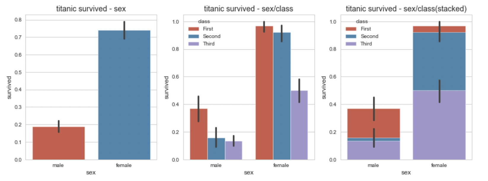

- *dodge* : 그래프를 누적으로 표시할 것인지에 대한 여부

``` python
import matplotlib.pyplot as plt
import seaborn as sns

titanic = sns.load_dataset('titanic')
sns.set_style('whitegrid')

fig = plt.figure(figsize = (15, 5))
ax1 = fig.add_subplot(1,3,1) #1행 3열의 첫째줄
ax2 = fig.add_subplot(1,3,2) #1행 3열의 둘째줄
ax3 = fig.add_subplot(1,3,3) #1행 3열의 셋째줄

sns.countplot(x = 'class', palette = 'Set1', data = titanic, ax = ax1)
sns.countplot(x = 'class', hue = 'who', palette = 'Set2', data = titanic, ax = ax2)
sns.countplot(x = 'class', hue = 'who', palette = 'Set3', dodge = False, data = titanic, ax = ax3) #dodge: 누적으로 표시할 것인지

ax1.set_title('titanic class')
ax2.set_title('titanic class - who')
ax3.set_title('titanic class - who(stacked)')

plt.show()
```

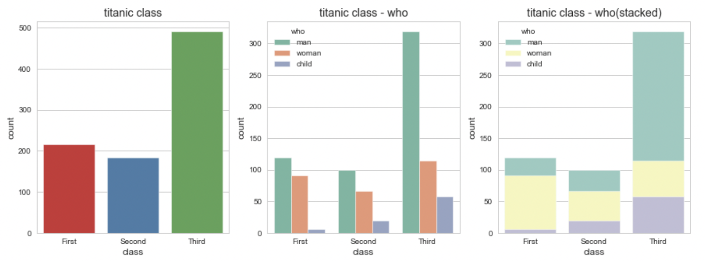


## 2. folium

folium은 파이썬의 지도 시각화 라이브러리다. 사용하기 전 folium을 설치해야 하므로 터미널에서 `conda install -c conda-forge folium` 을 입력해준다. 참고로, folium은 웹 환경에서만 작동이 가능하다.

- *folium.Map()* :지도를 만들어주는 함수
- *location([위도, 경도])*: 위도와 경도 표시
- *zoom_start* : 확대의 정도 지정, 최대 18
- *folium.Marker([위도, 경도], popup = '클릭시 나타났으면 하는 태그').add_to(지도명)*: 지도에 마커를 추가해 주겠다.

위의 함수와 명령어를 사용해서 서울의 지도를 만들어보면, 아래와 같은 코드로 작성해볼 수 있다.


``` python
import folium

seoul_map = folium.Map(location = [37.55, 126.98], zoom_start = 12) #위도는 37.55, 경도는 126.98, 확대 정도가 12인 folium.Map을 만들어준다.

seoul_map.save('seoul.html') #지도를 html 파일로 저장
seoul_map #주피터 노트북에서 보고싶다면 이렇게 객체 이름을 입력하면 된다.
```


### tiles

*tiles* 기능을 사용해서 지도의 스타일을 변경할 수도 있다. `Stamen Terrain, Stamen Toner, Stamen Water Color, CartoDB Positron` 정도가 대표적이며, 이외에도 종류가 많이 있다.

- *tiles = '타일명'*

``` python
seoul_map2 = folium.Map(location=[37.55, 126.98], tiles = 'Stamen Terrain', zoom_start = 12) #타일 스타일을 'Stamen Terrain'으로 지정

seoul_map2
```

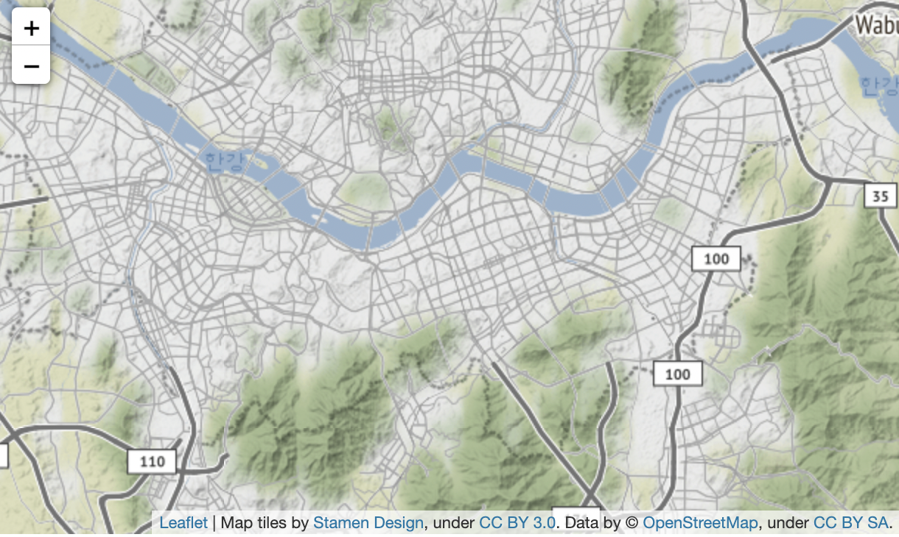

``` python
seoul_map3 = folium.Map(location=[37.55, 126.98], tiles = 'Stamen Toner', zoom_start = 12)
seoul_map3 #Toner는 지도를 흑백으로 나타내 준다.
```

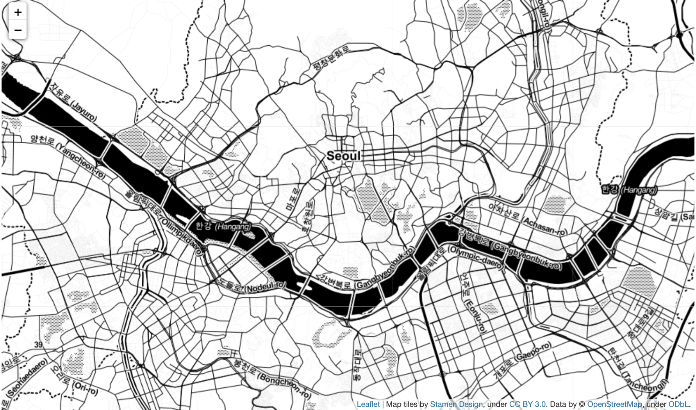

### marker

단순히 지도만 나타내는 게 아니라, 마커를 통해 특정 위치를 표시해줄 수 있다. 원하는 위치에 마커를 설정해주고, 클릭 시 표시되는 문구도 지정해줄 수 있다. 마커에 대한 스타일 변경도 가능하다. 마커에 대해 스타일을 변경하고 싶다면 icon 파라미터에 `folium.Icon(color='컬러', icon='아이콘')`을 지정해주면 된다. **예시)** `icon=folium.Icon('red', icon='star')`  

*popup*이나  *tooltip*에는 url을 삽입할 수도 있다. `popup = '<iframe width = "500px", height = "315px", src="url">이름</iframe>'` 이런 식으로 해주면 된다.

- *location* : 위도, 경도
- *popup* : 클릭 시 표시되는 문구
- *tooltip* : 마우스오버 시 표시되는 문구

#### - 서울 지역 대학교 표시하기


서울 지역 지도에 대학교 위치를 표시해주는 마커를 만들고자 한다.

우선 대학교 위치를 지도와 연계해야 하기 때문에, 위 형식으로 되어있는 '서울지역 대학교 위치' 엑셀 파일을 데이터프레임 형태로 변환해주어야 한다. *read_excel*을 통해 변환을 해준 후 folium으로 만든 서울 지도에 추가해준다.

그 다음 for문에 name(학교명), lat(위도), lng(경도) 변수를 하나의 튜플로 묶어 seoul_map에 순서대로 추가해준다. 이 때 add_to 구문을 사용해주어야 한다. 마지막으로 *seoul_map.save('파일명')*을 넣어주면 마커가 표시된 지도를 확인할 수 있다. 

- *zip()*: 여러 개의 데이터를 하나의 튜플로 만들어주는 함수

``` python
import pandas as pd
import folium

#대학교 리스트를 데이터 프레임으로 변환
df = pd.read_excel('서울지역 대학교 위치.xlsx')

#서울 지도 만들기
seoul_map = folium.Map(location = [37.55, 126.98], tiles = 'Stamen Terrain', zoom_start = 12)

#대학교 위치 정보를 Marker로 표시
for name, lat, lng in zip(df.학교, df.위도, df.경도):
    folium.Marker([lat, lng], popup = name).add_to(seoul_map)
#popup은 숫자뿐이 아니라 다양한 걸 넣을 수도 있다.
seoul_map.save('seoul_colleges.html')
seoul_map
```


위와 같이 지도에 대학교의 마커가 잘 표시되어 나온다. 마커를 클릭하면 학교의 이름이 나오도록 설정되어있다.


그런데 여기서 문제가 있다. 마커를 표시할 때 글자가 세로로 출력되는 것이다. 이렇게 출력되는 이유는 프레임의 크기를 따로 설정해주지 않았기 때문이다. 프레임의 크기를 충분하게 지정해주면 글자가 가로로 출력될 수 있을 것이다. 이를 해결하기 위해 아래의 코드를 사용한다.

- *iframe*: 윈도우 레이아웃과 비슷한 역할. 크기를 세팅해준다.
- *folium.Popup* : iframe을 팝업객체로 변환

``` python
 iframe = folium.IFrame(name, width = 200, height = 30)
 popup = folium.Popup(iframe, max_width = 300)
```

``` python
import pandas as pd
import folium

#대학교 리스트를 데이터 프레임으로 변환
df = pd.read_excel('서울지역 대학교 위치.xlsx')

#서울 지도 만들기
seoul_map = folium.Map(location = [37.55, 126.98], tiles = 'Stamen Terrain', zoom_start = 12)

#대학교 위치 정보를 Marker로 표시
for name, lat, lng in zip(df.학교, df.위도, df.경도):
    iframe = folium.IFrame(name, width = 200, height = 30)
    popup = folium.Popup(iframe, max_width = 300)
    folium.Marker([lat, lng], popup = popup).add_to(seoul_map)
    
seoul_map
```


#### - circle marker

기본형 마커의 모양이 마음에 들지 않는다면 다른 모양의 마커로 변경이 가능하다. 이번에는 circle marker를 사용해 같은 데이터를 나타내주었다. 원형이므로 반지름, 원 내부 색상 등을 추가로 설정해줄 수 있음을 참고하자

- *radius* : 원의 반지름
- *color* : 원의 둘레 색상
- *fill* : 원 내부에 색상을 채울 것인지 확인
- *fill_color* : 원 내부를 채우는 색상
- *fill_opacity* : 원의 투명도

``` python
import pandas as pd
import folium

#대학교 리스트를 데이터 프레임으로 변환
df = pd.read_excel('서울지역 대학교 위치.xlsx')

#서울 지도 만들기
seoul_map = folium.Map(location = [37.55, 126.98], tiles = 'Stamen Terrain', zoom_start = 12)

for name, lat, lng in zip(df.학교, df.위도, df.경도):
    folium.CircleMarker([lat, lng], radius = 10, color = 'brown', fill = True, fill_color = 'coral', fill_opacity = 0.7, popup = name).add_to(seoul_map)
#반지름 10, 컬러는 브라운, 원의 내부를 채워주고 채우는 색은 '코랄', 투명도는 0.7인 서클 마커를 사용한다.
seoul_map
```


