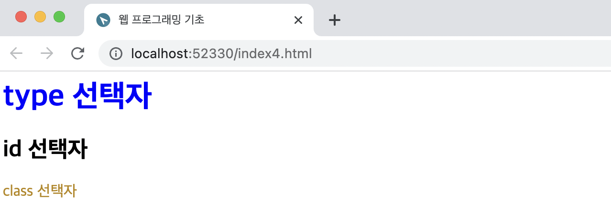

# 웹 프로그래밍

크롤링을 하기 위해서는 웹에 대한 이해가 필요하다. 웹의 구성요소인 레이아웃과 다양한 요소를 간단하게 공부해본다.

## 웹의 구성요소

### 개발 언어

웹을 제작할 때 사용되는 개발 언어에는 **HTML, CSS, Java Script**가 있다. HTML은 정보 영역을 담당하는 개발 언어로 텍스트, 이미지 등을 담을 수 있다. 주로 화면의 레이아웃을 구성할 때 사용한다. CSS는 디자인적인 요소들을 담는 개발언어이다. 버튼에 색상을 지정하는 등의 역할을 한다고 보면 되겠다. Java Script는 웹페이지의 기능적인 영역을 담당한다. 집을 짓는다고 생각해봤을 때, HTML은 건물의 설계도, CSS는 인테리어, Java Script는 지문인식 시스템과 같은 기능적인 부분을 하는 것이다. 참고로, 이 세 가지를 하는 사람을 주로 프론트엔드 개발자 라고 한다.(반대는 백엔드 개발자로 ASP/ASPNET, JSP, PHP를 한다.)

### 레이아웃의 종류

웹페이지를 구성하는 기본적인 레이아웃의 종류는 4가지가 있다. 요즘에는 적응형 레이아웃, 반응형 레이아웃이 대부분 사용되고 있다.

- 정적 레이아웃: 공간의 크기가 변하지 않는다. 변하지 않는 레이아웃으로 만약 브라우저의 너비를 줄이면 가로스크롤이 나오거나 콘텐츠가 잘리는 현상이 발생한다.
- 동적 레이아웃: 공간의 크기가 동적으로 변한다. 화면에 콘텐츠가 꽉 채워지게 된다. 단점으론 브라우저 넓이를 늘렸을 때 길게 늘어지는 현상이 발생할 수 있다는 것이다.
- 적응형 레이아웃: 정적 레이아웃과 비슷하나 사용자의 정의에 따라 레이아웃의 형태가 변한다. 노트북, 태블릿 등 다양한 기기에서 화면을 지원할 수 있다.
- 반응형 레이아웃: 동적 레이아웃과 적응형 레이아웃을 결합한 형태의 레이아웃으로, 최근 가장 많이 사용되고 있는 레이아웃 형태. 웹사이트를 하나만 제작하면 어느 기기에나 반응하여 최적화되어 나타낸다. 개발비용을 줄일 수 있다는 장점이 있다.

**웹 크로스 브라우징** : 웹페이지를 제작할 때에는 모든 브라우저에서 깨지지 않고 의도한 대로 적용될 수 있어야 한다. 이를 위해서 하는 작업이 바로 '웹 크로스 브라우징'이다. 만약 내가 만든 페이지가 어느 브라우저에서 제대로 작동하는 지 알고 싶다면 [Can I use](http://caniuse.com) 사이트를 통해 확인해볼 수 있다.

## HTML 시작하기

*HTML(=HyperText Markup Language)* : 웹사이트를 만들기 위해 사용하는 프로그래밍 언어. HTML 태그는 열린태그와 닫힌 태그, 속성, 속성값으로 구성된다. 꺽쇠 안에<> 들어간 것을 태그라고 부른다.

``` html
<h1>
  <a href = "https://www.naver.com">네이버</a>
</h1>
```

예를 들어 위와 같은 html문이 있다면 *h1과 /h1*은 각각 **열린태그와 닫힌태그**, *href*는 **속성**, *"https://www.naver.com"*는 **속성값** 을 의미한다.

### doctype

DOCTYPE은 문서의 용어를 정의하기 위해 사용하는 선언문이다. 웹 문서의 시작을 알려주며, `<html>` 태그보다 먼저 선언한다. doctype은 웹 브라우저에서 처리할 문서가 html이며 어떠한 버전으로 사용하였으니 해당 방식으로 해석해주어라 라는 의미를 갖고있다. html에서는 대소문자를 구분하지 않지만, doctype은 강조하는 의미에서 대문자로 선언하는 것이 일반적이다.

### html 주요 태그

html에서 자주 사용되는 태그는 `head, body, title, br, a, p` 등 그 종류가 매우 다양하다. 아래 주요한 태그들을 정리하고, 추가로 직접 입력해 본 html코드로 자주 사용되는 태그를 파악해보았다. 더 많은 태그는 이 [사이트](http://www.tcpschool.com/html-tags/intro)에서 참고해보도록 하자

#### head 태그

문서의 머리를 나타내는 태그. 브라우저 화면에 직접적으로 노출되지는 않으며, 숨은 데이터들을 정의하는 태그들이 들어간다.

`<title>` : 웹페이지의 제목을 나타냄. 브라우저의 탭에서 확인이 가능하다.

`<meta>` : 웹페이지의 보이지 않는 정보를 제공할 때 쓰이는 태그. 페이지의 설명 요약, 핵심 키워드, 제작자, 크롤링 정책 등 다양한 정보를 제공할 수 있다. 닫는 태그가 따로 필요하지 않다.

#### body 태그

`<br>` : 줄바꿈

`<p>` : 문단

`<b>` : *bold*의 약자로, 글씨를 굵게 표시. 최근에는 같은 기능을 하는 `<strong>` 태그를 더욱 권고한다.

`<p>` : 문단을 정의할 때 사용하는 태그

`<i>` : *italic* 으로 글자 기울이기 기능

`<h#>` : `<h1> ~ <h6>`으로 섹션, 문단의 제목을 나타내며 숫자가 작을수록 글자의 크기가 크다.

`<a>` : 하이퍼링크를 걸어주는 태그. 속성으로 *href*, *target* 이 있다.

`` : 이미지를 삽입하는 태그로, *src* 속성을 이용해 삽입하여 준다. 이미지 파일이 *src* 속성 값의 경로에 없을 때 이미지는 표시되지 않거나 x 표시로 나타난다.

`<table>` : 표를 만드는 태그. `<tr>`은 행, `<td>`는 열을 의미한다.

`<div>` : *division*의 약자로 레이아웃을 나누는 데 주로 쓰인다.

`<span>` : inline으로 주어진 데이터만큼만 공간을 갖는 태그. 인라인 요소를 하나로 묶을 때 사용한다.

`<li> `: 리스트를 만드는 태그. 순서가 있는 `<ol>`과 순서가 없는 `<ul>`가 있다.

`<form>` : 웹페이지에서의 입력 양식을 의미한다. 로그인 창이나, 회원가입 양식 등에 사용된다.

``` html
<!DOCTYPE html>
<html>
  <head>
    <title>Jmyee's</title>
  </head>
  <body>
    <h1>
      제목 1
    </h1>
    <br>br은 다음 줄로<br>넘어간다는 의미입니다.
    <h2>
      
    </h2>
      <p>이 문장은 단락입니다 1</p>
      <p>이 문장은 단락입니다 2
      <span style="color:blue">Jeongminyee</span></p>
  </body>
</html>
```


코드를 직접 입력해보고 해당 브라우저로 이동하면 위와 같은 결과를 볼 수 있다. 연습을 위한 무료 이미지 소스가 필요하다면 [픽사베이](https://pixabay.com/ko/)에서 무료 이미지를 다운받아 사용해보자.

## CSS

### css 기초

CSS(Cascading Style Sheets)는 웹페이지를 꾸미기 위해 작성하는 코드이다. CSS를 통해 HTML 문서에 있는 요소들에 선택적으로 스타일을 적용할 수 있다. 

HTML 문서에 입력된 정보나 공간에 CSS 디자인 효과를 적용하기 위해서는 다음의 세 가지 방법 중 하나를 적용할 수 있다.

- 인터널 방식: HTML문서 안에 `<style>` 태그를 사용하여 적용하는 방식

  ``` html
  <html>
  <head>
    <style>
    h1{
        color:red;
    }
    </style>
  </head>
  <body>
  
  <h1>테스트 입니다.</h1>
  
  </body>
  </html>
  ```

- 인라인 방식: HTML 태그 안에 style 속성을 사용하여 적용하는 방식

  ``` html
  <html>
  <head>
  </head>
  <body>
  
  <h1 sytle="color : red;">테스트 입니다.</h1>
  
  </body>
  </html>
  ```

- 익스터널 방식: CSS 파일을 생성하여 HTML 문서와 연동하는 방식. head태그 안에 link 태그를 이용하여 CSS 파일을 적용한다.

  예) `<head><link rel = "stylesheet" type = "text/css" href = "test.css"></head>`

  아래는 세 가지 방식 중 **익스터널 방식**을 사용하여 작성하였다.

***HTML 문서***

``` html
<html>
<head>
    <title>웹 프로그래밍 기초</title>
    <link rel = 'stylesheet' href = 'style.css'>
</head>
<body>
    <h1>type 선택자</h1>
    <h2 id ='bg'>id 선택자</h2>
    <p class = 'size color'>class 선택자</p>
</body>
</html>
```

 ***style.css***
``` css
header{
    color: red;
} 

h1{
    color: blue;
}

p{
    color:darkgoldenrod;
}
```

**결과**



### css에서의 상속

css는 상속을 통해 부모 요소의 속성을 자식에게 상속할 수 있다. 상속 기능을 이용하면 반복적으로 진행해야 하는 번거로운 일들을 줄일 수 있다는 장점이 있다. 단, 속성 중에서는 상속이 되는 것과 되지않는 것이 있다는 것만 유의하자.

