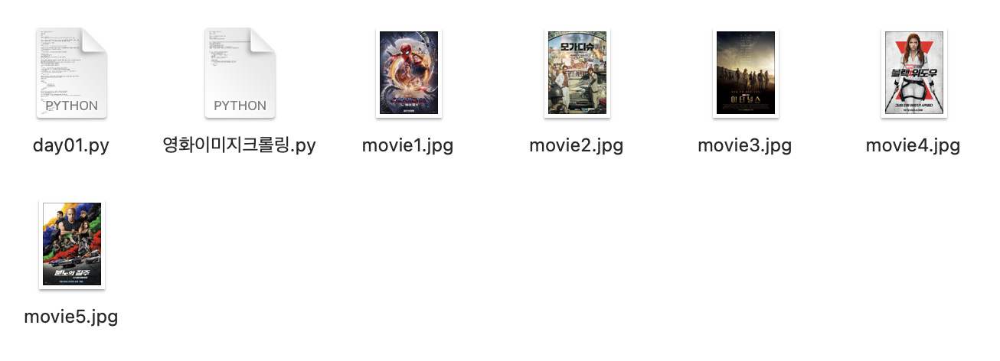
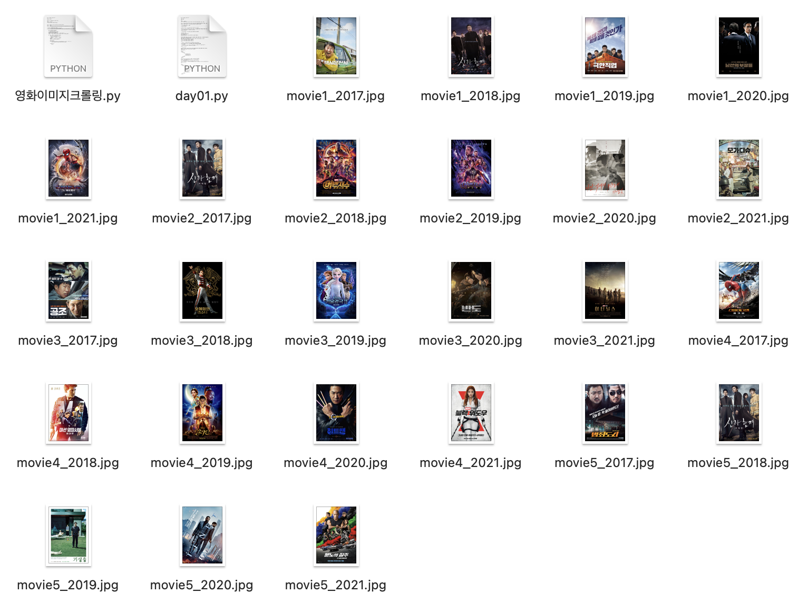

# 웹 크롤링을 활용한 데이터 수집

## 크롤링 사전지식

### 1. 크롤링과 스크래핑

크롤링과 스크래핑은 거의 동일하게 사용되는 경향이 있지만, 엄밀히 다른 개념이다. 크롤링은 내가 원하는 정보를 갖고있는 모든 페이지를 끌어오는 것인 한편, 스크래핑은 그 크롤링해 온 자료 중에서 내가 원하는 부분만 추출하는 방식이기 때문이다.

- 스크래핑: 다운로드한 웹 페이지에서 필요한 정보를 추출하는 작업

- 크롤링: 웹페이지의 하이퍼링크를 순회하면서 웹 페이지를 다운로드하는 작업

- 크롤러: 크롤링을 하는 소프트웨어

### 2. 크롬 개발자 도구

  크롤링을 할 때에는 크롬 개발자 도구를 이용해 요소를 파악한다. Mac을 기준으로 개발자 도구를 살펴보는 방법을 아래에 간단히 정리했다.

  - *Fn + F12* 를 통해 **Elements 파악** : html에서 배운 여러 요소들을 확인할 수 있으며, 주로 CSS Selector, Xpath를 통해 Copy해올 수 있다.

  - *Fn + F12* 를 통해 **Network 파악**

    Request method: 어떻게 데이터를 넘길겻이냐

    -  GET: request 정보의 모든 값이 들어가는 방식. 주소창에 넘겨줌

    Status code: 상태를 알려줌

### 3. 주의사항

#### - 대상 웹페이지 조건 확인

크롤링을 할 때에는 몇가지 주의사항이 있다. **첫번째로 크롤링을 하고자 하는 페이지의 조건을 확인해주어야 한다.** 사용하고자 하는 페이지의 ***주소/robots.txt***를 검색해보면 관련한 조건들을 확인할 수 있다. 예시로 다음 웹페이지에서 robots.txt를 쳐보면 아래와 같음을 확인할 수 있다. 참고로, 다음은 루트 이하의 모든 크롤링을 금지한다.

```
User-agent: * #모든 에이전트에 대해 허락하지 않는다.(Disallow. 크롤링 불가)
Disallow: /
```

#### - 크롤러 분류 - 상태 유무, Java script 유무

상태 유무와 자바스크립트 유무를 확인해주어야 한다. 어떤 데이터는 로그인을 해야만이 보여지는 정보일 수 있기에 꼭 **상태 유무**를 확인해주어야 하며, **Java script**로 데이터를 보여줄 경우에는 셀레니움과 같은 다른 엔진을 사용하여 진행해야 한다.

#### - Request 요청 시 서버 부하 고려

request를 요청할 경우에는 서버 부하를 고려해야 한다. 크롤링이 무한하게 지속되서 하면 서버가 부하되어 차단될 수 있다. 이러한 경우에는 직접 관련 기업에 전화하여 차단을 풀어줄 것을 요청해야 하기 때문에, 꼭 주의하여 진행해야 한다.

#### - 콘텐츠 저작권

스타의 사진이나 인물사진 등은 콘텐츠 저작권이 걸려있을 수 있다. 법적 책임을 물을 수 있는 요소이므로 저작권 여부를 잘 확인하여야 한다.

#### - 구조 변경 가능성

## 크롤링 기초 실습

### request 패키지

크롤링을 실습해보기 위해 우선 request 패키지를 설치한다. Python에서 기본 라이브러리로 urllib가 제공되지만, request 패키지는 이보다 더 간결한 코드로 다양한 HTTP요청을 할 수 있는 라이브러리 이기 때문에 사용한다.

``` terminal
conda activate
pip install requests
```

**사용법**

``` python
import requests
url = "원하는 url 입력"
response = requests.get(url)
```

### BeautifulSoup

requests.txt를 사용해 가져온 문서는 텍스트 형태이다. 이 데이터에서 원하는 html 태그를 쉽게 추출해주기 위해 BeautifulSoup를 사용해준다. 조금 더 자세한 설명이 필요하다면 이 [사이트](https://wikidocs.net/85739)를 확인해보자.

``` python
import requests
from bs4 import BeautifulSoup

url = '크롤링 할 url'

response = requests.get(url)

if response.status_code == 200: #상태가 정상인 코드라면
    html = response.text
    soup = BeautifulSoup(html, 'html.parser') #뷰티풀스프를 이용해 파싱 해준다.(수프 객체로 반환)
    print(soup)

else : 
    print(response.status_code)
```

## 영화 이미지 크롤링하기

### 1. 영화 포스터 스크래핑(2021)

다음(daum) 사이트에 있는 영화 이미지들을 가져와보도록 하자. 우선 구조는 영화순위를 검색해 봤을 때 나오는 이미지를 한 번 크롤링한 후, 크롤링한 값중에 image주소를 다시 가져와야만 다운로드가 가능한 형태이다. 즉, 크롤링을 이중으로 수행하여야 하는 것이다.

- *attrs* : attribute의 약자. 속성을 의미한다.
- *raise_for_status* : 에러가 났을 때 작업을 멈추고 알려주는 코드
- *HTML Parse*란 HTML 문법 규칙에 따른 문자열을, 해당 문법을 바탕으로 단어의 의미나 구조를 분석하는 것을 의미한다.
- *binary file* : 바이너리 파일은 텍스트 파일이 아닌 컴퓨터 파일을 의미한다.  바이너리 파일이라는 용어는 논-텍스트 파일(non-text file)을 의미하는 용어로 사용된다. 바이너리 파일을 쓸 때에는 'w'모드가 아닌 *'wb'모드로* 써야 한다.

``` python
import requests
from bs4 import BeautifulSoup

url = "https://search.daum.net/search?w=tot&q=2021%EB%85%84%EC%98%81%ED%99%94%EC%88%9C%EC%9C%84&DA=MOR&rtmaxcoll=MOR"
res = requests.get(url)
res.raise_for_status() #에러가 있을 경우 에러가 났음을 알려주는 코드

#크롤링한 데이터를 bs4객체로 변환
soup = BeautifulSoup(res.text, "html.parser")
images = soup.findAll("img", attrs={"class":"thumb_img"}) #img의 속성값이 class = 'thumb_img'인 것들을 모두 찾는다.

for idx, image in enumerate(images): #enumerate는 '열거하다'라는 뜻
    img_url = image["src"]
    if img_url.startswith("//"): #만약 https가 없다면 정상적으로 출력하기 위해 https:를 넣어준다.
        img_url = "https:" + img_url
    #재크롤링
    img_res = requests.get(img_url)
    img_res.raise_for_status()
    
    #파일로 저장하기
    with open("movie{}.jpg".format(idx+1), "wb") as f: #바이너리 파일 형식
        f.write(img_res.content) #바이너리라서.content
    
    if idx >= 4: #5개의 이미지만 나오도록 한다.
        break;
```




### 2. 5년치의 영화 이미지 스크래핑(2017 ~ 2021)

이번에는 최근 5개년의 영화 이미지를 크롤링해 다운받아보도록 하겠다. 이때, 2021, 2020 등 영화순위의 url이 바뀌는 패턴을 찾아야 한다. 2021년의 url을 보았을 때 https://search.daum.net/search?w=tot&q=2021%EB%85%84%EC%98%81%ED%99%94%EC%88%9C%EC%9C%84&DA=MOR&rtmaxcoll=MOR 중 **&q=2021** 부분이 년도를 나타내는 것을 확인했다. 이 부분을 바꾸어 반복해주면 5년치의 영화 이미지를 확인할 수 있을 것이다. 여기서는 해당 부분을 바꾸기 위해 *{0}, .format()* 구문을 사용해주었다.

``` python
import requests
from bs4 import BeautifulSoup

for year in range(2017, 2022): #2017년부터 2021년까지 반복
    url = "https://search.daum.net/search?w=tot&q={0}%EB%85%84%EC%98%81%ED%99%94%EC%88%9C%EC%9C%84&DA=MOR&rtmaxcoll=MOR".format(year)
    
    res = requests.get(url)
    res.raise_for_status()
    
    #크롤링한 데이터를 bs4객체로 변환
    soup = BeautifulSoup(res.text, "html.parser")
    images = soup.findAll("img", attrs={"class":"thumb_img"})
    
    for idx, image in enumerate(images):
        img_url = image["src"]
        if img_url.startswith("//"):
            img_url = "https:" + img_url
        #재크롤링
        img_res = requests.get(img_url)
        img_res.raise_for_status()
        
        #파일로 저장하기
        with open("movie{0}_{1}.jpg".format(idx+1, year), "wb") as f:
            f.write(img_res.content) #이미지가 어느 연도인지도 구분할 수 있도록 파일명에 year추가
        
        if idx >= 4:
            break;
```



