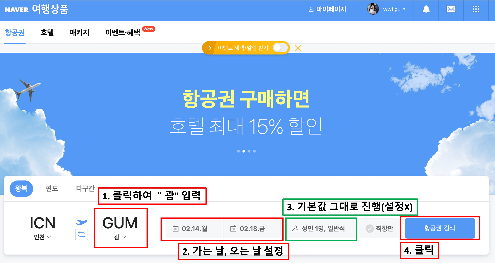

# Requests, Beautifulsoup, Selenium

## 파이썬으로 크롤링 시 주로 사용하는 라이브러리

**Requests**
파이썬에서 동작하는 작고 빠른 브라우저
웹서버로부터 초기 HTML만 받을 뿐, 추가 CSS/JavaScript 처리 X
거의 모든 플랫폼에서 구동 가능

**Selenium**
브라우저를 원격 컨트롤하는 테스팅 라이브러리
Chrome, Firefox, IE, phantomJS 등
기존 브라우저를 사용하므로, 추가 CSS/JavaScript 처리 지원
리소스를 많이 먹는다. 사이트에 따라 죽기도 한다.

**BeautifulSoup4**
HTML parser
지정 HTML로부터 원하는 위치/형식의 문자열을 획득
주로 Requests에 의해 많이 사용되지만, Selenium에서도 사용할 수 있다.

## - 네이버 웹툰 목록 가져오기

Requests 라이브러리를 사용하여 한 웹툰의 1페이지 제목 목록을 가져온다. 이때, 해당 사이트 링크도 함께 나오도록 설정해준다.

- *raise_for_status()*: 오류가 발생하면 HTTPError라고 알려주도록 한다.

``` python
import requests
from bs4 import BeautifulSoup

url = "https://comic.naver.com/webtoon/list?titleId=700844"
res = requests.get(url)
res.raise_for_status()

soup = BeautifulSoup(res.text, "html.parser")

#네이버웹툰 목록 전부 가져오기
webtoons = soup.find_all("td", attrs = {"class": "title"})
for webtoon in webtoons:
  print(webtoon.a.text, "")
```

**결과**

``` python
후기 https://comic.naver.com//webtoon/detail?titleId=700844&no=214&weekday=fri
외전 마지막화 크리스마스 이브 https://comic.naver.com//webtoon/detail?titleId=700844&no=213&weekday=fri
외전12화 프러포즈(하) https://comic.naver.com//webtoon/detail?titleId=700844&no=212&weekday=fri
외전11화 프러포즈(상) https://comic.naver.com//webtoon/detail?titleId=700844&no=211&weekday=fri
외전10화 각자의 길 https://comic.naver.com//webtoon/detail?titleId=700844&no=210&weekday=fri
외전9화 너와의 마지막 학교 생활 https://comic.naver.com//webtoon/detail?titleId=700844&no=209&weekday=fri
외전8화 너와 함께 하는 아르바이트 https://comic.naver.com//webtoon/detail?titleId=700844&no=208&weekday=fri
외전7화 재회 https://comic.naver.com//webtoon/detail?titleId=700844&no=207&weekday=fri
외전6화 이별 https://comic.naver.com//webtoon/detail?titleId=700844&no=206&weekday=fri
외전5화 둘만의 밤바다 https://comic.naver.com//webtoon/detail?titleId=700844&no=205&weekday=fri
```

## - 네이버 웹툰 평점 가져오기

이번에는 동일한 페이지의 웹툰들의 평점을 가져와본다. 우선 우리가 가져와야 할 부분을 html로 나타내 보았다.

``` html
<td>
	<div calss="rating_type">
    <span class="star">
    	<em style="width:99.88%">평점</em> <!--가져오면 안되는 부분-->
    </span>
    <strong>9.99</strong> <!--우리가 가져와야 할 부분-->
  </div>
</td>
```

이때, 주의할 점은 *attrs = ({"class" : "rating_type"})*으로 설정하여 *print*를 하면 '평점'이라는 말도 함께 나오게 된다는 부분이다. 우리는 평점의 실젯값인 9.99만을 가져와야 하므로 print하는 부분에서 class가 rating_type이면서도 + 그 안에 strong에 속하는 것만을 가져오겠다고 명시해주어야 한다.

``` python
import requests
from bs4 import BeautifulSoup

url = "https://comic.naver.com/webtoon/list?titleId=700844"
res = requests.get(url)
res.raise_for_status() 

soup = BeautifulSoup(res.text, "html.parser")

#네이버웹툰 평점 가져오기
stars = soup.find_all("div", attrs = ({"class":"rating_type"}))
for a in stars:
  print(a.strong.text) #실제 평점만 가져오도록 처리
```

**결과**

``` python
9.99
9.98
9.97
9.96
9.98
9.98
9.98
9.97
9.96
9.97
```

## - 평점의 평균 구하기

산출해낸 평점으로 평균도 구할 수 있다. 대부분은 위의 코드들과 동일하므로, 평점을 구할 부분만 아래에 정리했다.

``` python
stars = soup.find_all("div", attrs = ({"class":"rating_type"}))
sum = 0 #평점의 합을 구하기 위해 첫값을 정의
for a in stars:
  rate = float(a.strong.text) #소수자리도 있으므로 실수형으로 반환
  sum += rate #평점의 합계 산출
print(sum/len(stars)) #합계를 stars의 길이(갯수)로 나누어줌
```

**결과** 해당 코드의 결과값은 *9.974*가 나오게 된다.

# Selenium

셀레니움은 파이어폭스, 익스플로러, 크롬 등의 브라우저를 컨트롤 할 수 있게 해준다. 터미널에서 *pip install selenium* 코드를 입력하여 설치할 수 있다. 드라이버를 함께 설치해주어야 하는데, 이번 차시에는 크롬을 주로 사용하므로 크롬 드라이버를 설치해주었다.(이때, 자신의 컴퓨터에서 사용되고 있는 브라우저의 버전을 잘 확인하여 설치해주도록 하자)

**브라우저 열기**

``` python
from selenium import webdriver
driver = webdriver.Chrome("크롬 드라이버 설치 경로")
```

크롬 드라이버 설치 경로: 윈도우는 chromedriver.exe까지 써주어야하고, Mac은 chromedriver까지만 입력해주면 된다.

## 드라이버 작동 코드
### - 기본

- *driver.back()* : 이전 화면 이동

- *driver.forward()* : 다음 화면 이동

- *driver.refresh()* : 새로고침
- *driver.close()* : 현재 탭 닫기
- *driver.quit()* : 모든 브라우저 닫기

작동이 너무 빠를 때 , time을 사용해 단계 사이사이에 시간(초)을 넣어서 단계가 더 잘 보이도록(천천히) 설정할 수 있다.

``` python
import time
time.sleep(3) #동작 전 3초동안 멈춤
```

### - element 다루기

웹브라우저 상에서 보이는 버튼, 검색창 등에 우리는 입력, 클릭 등 다양한 동작을 하게 된다. 이러한 것들을 element(요소)라고 한다. 셀레니움은 여러가지 동작을 할 때 요소의 개념으로 작동을 하게 되므로, element를 다루는 여러 명령어를 정리해보았다. [참고](https://pythondocs.net/selenium/%EC%85%80%EB%A0%88%EB%8B%88%EC%9B%80-%ED%81%AC%EB%A1%A4%EB%9F%AC-%EA%B8%B0%EB%B3%B8-%EC%82%AC%EC%9A%A9%EB%B2%95/)

- *driver.find_element_by_xpath("주소")*
- *driver.find_element_by_class("클래스")*
- *driver.find_element_by_id("id")*
- *driver.find_element_by_link_text("텍스트")*
- *driver.find_element_by_css_selector("css")*
- *driver.find_element_by_tag_name("tag name")*

여러가지 값들을 추출할 때는 `find_element`를 `find_elements`로 변경하고 그 뒤에 리스트를 추출하는 것처럼 [0], [1]등을 지정하여 추출할 수 있다.

- element 클릭: *driver.find_element_by_xpath("주소").click()*

- 텍스트 입력: *driver.find_element_by_xpath("주소").send_keys('text')*

- 텍스트 삭제: *driver.find_element_by_xpath("주소").clear()*

- 단축키 입력

  ``` python
  from selenium.webdriver.common.keys import Keys
  
  #붙여넣기
  driver.find_element_by_id('id').send_keys(Keys.CONTROL + 'v') #mac은 command
  ```

  

## 1.  네이버 로그인 자동화

셀레니움을 사용해 네이버 로그인 자동화 코드를 작성해보았다. 다음 코드는 정상적으로 작동하나, 네이버에서 로그인 자동화 기능을 보안을 위해 막아두었으므로, 로그인이 실제로 실행되지는 않는다는 점을 참고할 것!

``` python
from selenium import webdriver
from selenium.webdriver.common.keys import Keys
import time

url = "https://www.naver.com/"
driver = webdriver.Chrome("/Users/yunjeongmin/Desktop/multicampus/chromedriver")


try:
    driver.get(url) #해당 url 켜주기
    element = driver.find_element_by_class_name("link_login")
    element.click() #로그인 버튼 클릭
    loginid = driver.find_element_by_id("id")
    loginpw = driver.find_element_by_id("pw")
    send = driver.find_element_by_class_name("btn_login")
    
    loginid.send_keys("아이디") #내아이디
    loginpw.send_keys("비밀번호") #내비밀번호
    send.click()
        
except Exception as e:
    print(e)
```


## 2. 네이버 항공권 자동화

[네이버 항공](https://flight.naver.com/)에서 여행하고자 하는 나라와 일정을 체크해, 가장 저렴한 항공권을 조회하는 과정을 자동화해보았다. 네이버 항공의 페이지는 아래와 같이 구성되어 있으며, 작업할 부분을 표시해 보았다.



``` python
from selenium import webdriver 
from selenium.webdriver.common.keys import Keys
from webdriver_manager.chrome import ChromeDriverManager
import time #각 동작 사이의 시간을 주어 끊김 방지

#크롬 웹드라이버를 불러와 기능이 작동할 수 있도록 적용
url = "https://flight.naver.com/"
driver = webdriver.Chrome("/Users/yunjeongmin/Desktop/multicampus/chromedriver")

try:
    driver.get(url) #네이버 항공 사이트 켜기
    time.sleep(1) #1초 시간간격
    country = driver.find_element_by_xpath("//*[@id='__next']/div/div[1]/div[4]/div/div/div[2]/div[1]/button[2]/i")
    time.sleep(1)
    country.click()
    time.sleep(1)
    
    #검색창 클릭
    driver.find_element_by_class_name("autocomplete_input__1vVkF").click()
    time.sleep(1)
    #검색창에 "괌" 입력
    driver.find_element_by_class_name("autocomplete_input__1vVkF").send_keys("괌")
    time.sleep(1)
    
    driver.find_element_by_xpath("//*[@id='__next']/div/div[1]/div[10]/div[2]/section/div/a").click()
    time.sleep(1)
    driver.find_element_by_class_name("tabContent_option__2y4c6.select_Date__1aF7Y").click()
    time.sleep(1)
    
    #가는 날 선택: 2월 14일
    driver.find_element_by_xpath("//*[@id='__next']/div/div[1]/div[4]/div/div/div[2]/div[2]/button[1]").click()
    time.sleep(1)
    driver.find_element_by_xpath('//*[@id="__next"]/div/div[1]/div[10]/div[2]/div[1]/div[2]/div/div[3]/table/tbody/tr[3]/td[2]/button/b').click() 
    time.sleep(1)

    #오는 날 선택: 2월 18일
    driver.find_element_by_xpath('//*[@id="__next"]/div/div[1]/div[10]/div[2]/div[1]/div[2]/div/div[3]/table/tbody/tr[3]/td[6]/button/i').click()
    time.sleep(1)

    #항공권선택
    driver.find_element_by_xpath('//*[@id="__next"]/div/div[1]/div[4]/div/div/button').click()
    time.sleep(15)

    #가장 저렴한 항공권 선택(첫번째 xpath 이용)
    choice = driver.find_element_by_xpath('//*[@id="__next"]/div/div[1]/div[4]/div/div[3]/div[1]/div')

except Exception as e:
    print(e) #오류가 날 경우 오류메세지 표시
finally:
    print(choice.text) #가장 저렴한 항공권 내용 print

```

